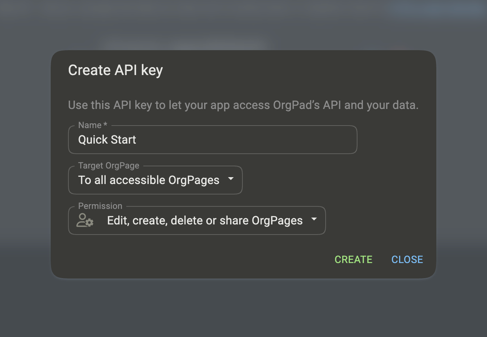
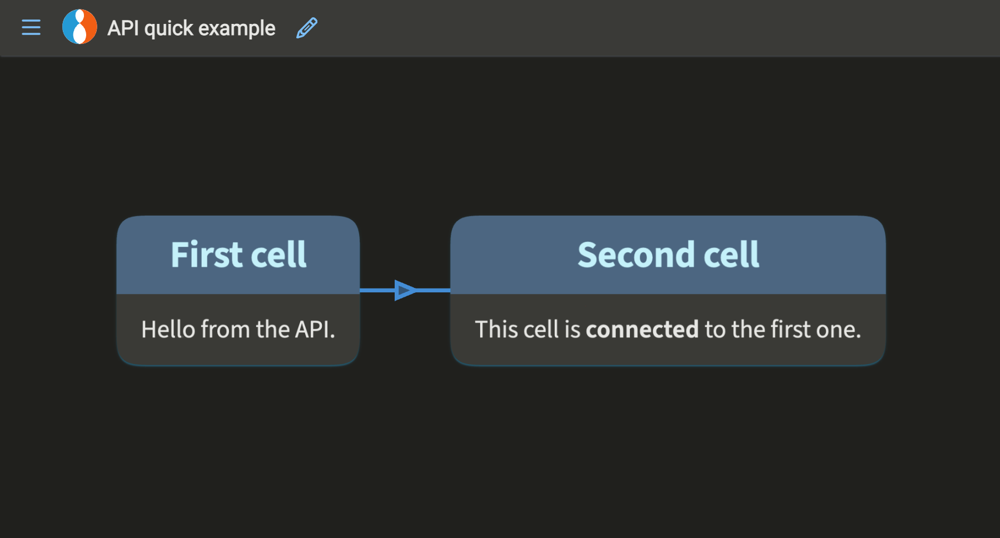

# OrgPad API v1

The OrgPad API is an experimental HTTP API that lets you read and edit OrgPages and their content.

You can use it to automate repetitive work, create OrgPages from external data, build custom integrations, or connect
OrgPad with tools you already use. The API supports JSON, EDN, and Transit for request and response bodies.

The API is still experimental, and your feedback can help shape it. If something is unclear, missing, or not working as
expected, create an issue here, join our [Discord server](https://orgpad.info/discord) or write to us
at [support@orgpad.info](mailto:support@orgpad.info).

## Contents

- [Core Concepts](#core-concepts)
- [Quick Start](#quick-start)
    - [Before you start](#before-you-start)
    - [1. Set your API key](#1-set-your-api-key)
    - [2. Test your API key](#2-test-your-api-key)
    - [3. Create an OrgPage](#3-create-an-orgpage)
    - [4. Add two connected cells](#4-add-two-connected-cells)
- [API Reference](#api-reference)
    - [Request formats](#request-formats)
    - [ID formats](#id-formats)
    - [Endpoint overview](#endpoint-overview)
    - [Reference pages](#reference-pages)
    - [API cookbook](cookbook.md)
    - [Common errors](#common-errors)

## Core Concepts

OrgPad stores visual documents called **OrgPages**. In the OrgPad interface, each visual node is called a **cell**. In
the API, a cell is represented by one **book unit** and one or more **page units**. A connection between two cells is
called a **link** both in the interface and the API. For other objects and details, see [OrgPage data](orgpage.md).

Most edits are made by sending **operations** to an OrgPage. For example, `unit/create` operation creates a cell,
and `link/create` connects two cells. For details, see [Operations](ops.md).

Every request requires an API key. A request succeeds only when both your user account and the API key have enough
permission. For details, see [Authentication and API keys](auth.md).

Some operation fields accept a `textId`. This is a user-defined identifier stored on an object, so it can be used
instead of the long UUID in the same request or in later requests. For details, see
[Text IDs](formats.md#text-ids).

## Quick Start

This quick start shows the full flow for your first API edit: setting up an API key, testing access, creating a new OrgPage, and adding two connected cells.

### Before you start

To run the examples, you need:

- an active OrgPad subscription with API access (Professional, School, or Enterprise),
- an API key with admin permission for creating OrgPages,
- `curl`,
- `jq`, used here to extract the new OrgPage ID from a response JSON.

### 1. Set your API key

Create a new API key in OrgPad settings under [API](https://orgpad.info/settings/api).

When creating the key, choose:

- **Target OrgPage**: To all accessible OrgPages
- **Permission**: Edit, create, delete or share OrgPages



This creates an API key with admin permission. You need this permission to create a new OrgPage.

Copy the API key, because you won’t be able to see it again. Then export the API key as an environment variable:

```bash
export ORGPAD_API_KEY="orgpad_…"
```

### 2. Test your API key

Test the key with a read-only request:

```bash
curl "https://orgpad.info/api/v1/o" \
  -H "Authorization: Bearer $ORGPAD_API_KEY" \
  -H "Accept: application/json"
```

This returns OrgPages accessible to your account. The response contains an `orgpages` array. If the request succeeds, your API key works.

### 3. Create an OrgPage

```bash
ORGPAGE_ID=$(
  curl -X POST "https://orgpad.info/api/v1/o" \
    -H "Authorization: Bearer $ORGPAD_API_KEY" \
    -H "Content-Type: application/json" \
    --data '{
      "title": "API quick example",
      "color": "color/red"
    }' \
  | jq -r '.id'
)

echo "$ORGPAGE_ID"
```

This sends a JSON body to create a new OrgPage, extracts the returned `id` with `jq`, and stores it in `ORGPAGE_ID` for the next request.

### 4. Add two connected cells

```bash
curl -X POST "https://orgpad.info/api/v1/o/$ORGPAGE_ID/ops" \
  -H "Authorization: Bearer $ORGPAD_API_KEY" \
  -H "Content-Type: application/json" \
  --data '[
    ["unit/create", {
      "textId": "first-cell",
      "pos": [0, 0],
      "title": "First cell",
      "content": "<p>Hello from the API.</p>"
    }],
    ["unit/create", {
      "textId": "second-cell",
      "pos": [360, 0],
      "title": "Second cell",
      "content": "<p>This cell is <b>connected</b> to the first one.</p>"
    }],
    ["link/create", {
      "endpointIds": ["first-cell", "second-cell"]
    }]
  ]'
```

This sends three operations: create the first cell, create the second cell, and connect them with a link.

The link uses the cells’ `textId` values, so you do not need their generated UUIDs.

The result is a new OrgPage called **API quick example** with two cells connected by one link.



For more practical examples, see the [API cookbook](cookbook.md). To learn how to edit OrgPages in detail, read
[Operations](ops.md), or use the [endpoint overview](#endpoint-overview) below to find a specific API feature. If a
request fails, use [How to debug an API error](errors.md#how-to-debug-an-api-error).

## API Reference

Use this section as a quick map for request rules, endpoints, and detailed reference pages.

### Request formats

JSON is the API default format. The API also supports EDN and Transit:

- Use JSON for most integrations.
- Use [EDN](https://github.com/edn-format/edn) if you work in Clojure.
- Use [Transit](https://github.com/cognitect/transit-clj) if you want more efficient transfer of EDN encoded into JSON.

JSON is used when `Content-Type` or `Accept` is omitted. Set `Content-Type` explicitly when sending EDN or Transit
request bodies, and set `Accept` explicitly when you want EDN or Transit responses.

| Format  | Content type               |
|---------|----------------------------|
| JSON    | `application/json`         |
| EDN     | `application/edn`          |
| Transit | `application/transit+json` |

For naming rules and examples, see [Input and Output Formats](formats.md).

### ID formats

OrgPad object IDs are [UUIDv4 values](https://en.wikipedia.org/wiki/Universally_unique_identifier). Public API endpoints
accept standard UUID strings and OrgPad compact UUID strings in base64. JSON responses return standard UUID strings.

OrgPad URLs usually use compact IDs. You may see them in image URLs, file links, embedded OrgPage URLs, or other
OrgPad-generated links.

For conversion details and examples, see [OrgPad UUID Formats](uuid.md).

### Endpoint overview

All API endpoints are under this base URL:

```text
https://orgpad.info/api/v1
```

Most OrgPage endpoints also support short-link paths. For example, `/o/{orgpage-id}/ops` can also be called as
`/s/{short-link}/ops`.

| Method   | Path                                                                                                         | Permission       | Description                                      | Reference                                                         |
|----------|--------------------------------------------------------------------------------------------------------------|------------------|--------------------------------------------------|-------------------------------------------------------------------|
| `GET`    | [`/public`](https://orgpad.info/api/v1/public)                                                               | view             | List public OrgPages and owners.                 | [Public OrgPage listing](read.md#public-orgpage-listing)          |
| `GET`    | [`/o`](https://orgpad.info/api/v1/o)                                                                         | view             | List accessible OrgPages and owners.             | [OrgPage listing](read.md#orgpage-listing)                        |
| `POST`   | [`/o`](https://orgpad.info/api/v1/o)                                                                         | admin            | Create a new OrgPage.                            | [Create OrgPage](management.md#create-orgpage)                    |
| `GET`    | [`/o/{orgpage-id}`](https://orgpad.info/api/v1/o/{orgpage-id})                                               | view             | Load the full OrgPage.                           | [Read full OrgPage](read.md#read-full-orgpage)                    |
| `DELETE` | [`/o/{orgpage-id}`](https://orgpad.info/api/v1/o/{orgpage-id})                                               | admin            | Delete an OrgPage.                               | [Delete OrgPage](management.md#delete-orgpage)                    |
| `GET`    | [`/o/{orgpage-id}/meta`](https://orgpad.info/api/v1/o/{orgpage-id}/meta)                                     | view             | Load OrgPage metadata.                           | [Metadata](read.md#metadata)                                      |
| `POST`   | [`/o/{orgpage-id}/ops`](https://orgpad.info/api/v1/o/{orgpage-id}/ops)                                       | edit             | Apply OrgPage operations.                        | [Operations endpoint](ops.md#operations-endpoint)                 |
| `POST`   | [`/o/{orgpage-id}/upload`](https://orgpad.info/api/v1/o/{orgpage-id}/upload)                                 | edit             | Upload files and images.                         | [Upload files and images](attachments.md#upload-files-and-images) |
| `POST`   | [`/o/{orgpage-id}/copy`](https://orgpad.info/api/v1/o/{orgpage-id}/copy)                                     | view + admin key | Copy an OrgPage.                                 | [Copy OrgPage](management.md#copy-orgpage)                        |
| `GET`    | [`/o/{orgpage-id}/unit/{unit-id}`](https://orgpad.info/api/v1/o/{orgpage-id}/unit/{unit-id})                 | view             | Load a unit and related objects.                 | [Unit](read.md#unit)                                              |
| `GET`    | [`/o/{orgpage-id}/link/{link-id}`](https://orgpad.info/api/v1/o/{orgpage-id}/link/{link-id})                 | view             | Load a link and its endpoint units.              | [Link](read.md#link)                                              |
| `GET`    | [`/o/{orgpage-id}/file/{file-id}`](https://orgpad.info/api/v1/o/{orgpage-id}/file/{file-id})                 | view             | Load a file and the pages or embeds that use it. | [File](read.md#file)                                              |
| `GET`    | [`/o/{orgpage-id}/image/{image-id}`](https://orgpad.info/api/v1/o/{orgpage-id}/image/{image-id})             | view             | Load an image and the pages that use it.         | [Image](read.md#image)                                            |
| `GET`    | [`/o/{orgpage-id}/math/{math-id}`](https://orgpad.info/api/v1/o/{orgpage-id}/math/{math-id})                 | view             | Load a math object and its page.                 | [Math](read.md#math)                                              |
| `GET`    | [`/o/{orgpage-id}/embed/{embed-id}`](https://orgpad.info/api/v1/o/{orgpage-id}/embed/{embed-id})             | view             | Load an embed and its page.                      | [Embed](read.md#embed)                                            |
| `GET`    | [`/o/{orgpage-id}/path/{path-id}`](https://orgpad.info/api/v1/o/{orgpage-id}/path/{path-id})                 | view             | Load a path and its steps.                       | [Path](read.md#path)                                              |
| `GET`    | [`/o/{orgpage-id}/fragment/{fragment-id}`](https://orgpad.info/api/v1/o/{orgpage-id}/fragment/{fragment-id}) | view             | Load a fragment.                                 | [Fragment](read.md#fragment)                                      |
| `GET`    | [`/o/{orgpage-id}/share`](https://orgpad.info/api/v1/o/{orgpage-id}/share)                                   | admin            | Load OrgPage sharing state.                      | [Read sharing state](management.md#read-sharing-state)            |
| `POST`   | [`/o/{orgpage-id}/share`](https://orgpad.info/api/v1/o/{orgpage-id}/share)                                   | admin            | Apply one sharing operation.                     | [Update sharing state](management.md#update-sharing-state)        |
| `GET`    | [`/file/{file-id}`](https://orgpad.info/api/v1/file/{file-id})                                               | view             | Load file metadata and accessible OrgPage IDs.   | [Attachment metadata](attachments.md#attachment-metadata)          |
| `GET`    | [`/img/{image-id}`](https://orgpad.info/api/v1/img/{image-id})                                               | view             | Load image metadata and accessible OrgPage IDs.  | [Attachment metadata](attachments.md#attachment-metadata)          |
| `POST`   | [`/file/{file-id}/rename`](https://orgpad.info/api/v1/file/{file-id}/rename)                                 | edit             | Rename a file in accessible OrgPages.            | [Rename files](attachments.md#rename-files)                       |
| `POST`   | [`/img/{image-id}/rename`](https://orgpad.info/api/v1/img/{image-id}/rename)                                 | edit             | Rename an image in accessible OrgPages.          | [Rename images](attachments.md#rename-images)                     |

For exact request bodies, response shapes, parameters, and examples, see the reference pages below.

### Reference pages

| Page                                          | What it covers                                                                                           |
|-----------------------------------------------|----------------------------------------------------------------------------------------------------------|
| [API cookbook](cookbook.md)                   | End-to-end examples for creating OrgPages, applying operations, uploading files, and using attachments.  |
| [Authentication and API keys](auth.md)        | API key format, creating keys, key scope, subscription requirements, and permissions.                    |
| [Input and output formats](formats.md)        | JSON, EDN, Transit, naming rules, headers, and examples.                                                 |
| [Errors](errors.md#how-to-debug-an-api-error) | Debugging workflow, error response format, HTTP status codes, and error-code index.                      |
| [OrgPad UUID formats](uuid.md)                | Standard UUIDs, compact UUIDs, URL-safe IDs, and conversion examples.                                    |
| [OrgPage data](orgpage.md)                    | Full OrgPage response shape, object fields, and complete examples.                                       |
| [Unit content](content.md)                    | Cell content format, supported content tags, and content examples.                                       |
| [Read endpoints](read.md)                     | Listing OrgPages and loading OrgPages, units, links, files, images, maths, embeds, paths, and fragments. |
| [Managing OrgPages](management.md)            | Creating, deleting, copying, and sharing OrgPages.                                                       |
| [Operations](ops.md)                          | Applying changes to OrgPages with operation vectors.                                                     |
| [Unit content in operations](ops_content.md)  | Content input formats, helper tags, appended content, and generated operations.                          |
| [Attachments](attachments.md)                 | Uploading files and images, and renaming uploaded assets.                                                |
| [Malli schemas](schema.cljc)                  | Standalone Clojure/[Malli](https://github.com/metosin/malli) schemas for EDN request bodies.             |
