# Unit Content

Unit content is the rich content stored inside OrgPad units: supported tags, attributes, CSS styles, and content
patterns.

Stored rich page content is represented as HTML in JSON responses. In EDN and Transit responses, the same content is
represented as [Hiccup](https://github.com/weavejester/hiccup), a nested Clojure data structure. OrgPad allows only a
restricted subset of HTML tags, attributes, and styles.

OrgPad sanitizes unit content before storing it. Unsupported attributes and styles are removed. Unsupported tags are also
removed, but their children are kept, so text and supported nested content are usually preserved.

Use this page when you need to understand content returned by the API or the final content shape stored in units. For
API operation input formats, helper tags, appended content, and automatic operation generation, see
[Unit content in operations](ops_content.md).

## Contents

- [Supported Tags](#supported-tags)
- [Supported Attributes](#supported-attributes)
- [Supported CSS Styles](#supported-css-styles)
- [List of Supported Content](#list-of-supported-content)
    - [Basic formatting](#basic-formatting)
    - [Multiple paragraphs](#multiple-paragraphs)
    - [Heading, hyperlink, and blockquote](#heading-hyperlink-and-blockquote)
    - [Text highlighting](#text-highlighting)
    - [Unordered list](#unordered-list)
    - [Ordered list](#ordered-list)
    - [Table](#table)
    - [Image](#image)
    - [Attached file](#attached-file)
    - [Embed](#embed)
    - [Embedded OrgPage](#embedded-orgpage)
    - [Video](#video)
    - [Audio](#audio)
    - [YouTube video](#youtube-video)
    - [Math and Chemistry](#math-and-chemistry)
    - [Code](#code)
        - [Supported code highlighting languages](#supported-code-highlighting-languages)
- [Related Pages](#related-pages)

## Supported Tags

These tags are the normalized stored tags. API input may accept additional helper tags that are converted before content
is stored.

OrgPad stores these regular HTML tags:

- Text blocks and inline text: `p`, `br`, `strong`, `em`, `s`, `sub`, `sup`, `blockquote`, `q`.
- Headings: `h4`. Other heading levels are normalized to `h4`. Unit content supports only one heading level because the
  three larger heading sizes are already used by the book `titleSize`.
- Lists: `ul`, `ol`, `li`.
- Hyperlinks: `a`.
- Media: `img`, `video`, `audio`, `source`.
- Tables: `table`, `thead`, `tbody`, `tr`, `th`, `td`.

OrgPad also stores these custom tags:

- `math`: rendered math or chemistry stored in the OrgPage `maths` collection.
- `embed`: URL or file embed stored in the OrgPage `embeds` collection.
- `youtube`: embedded YouTube video.
- `orgpage`: embedded OrgPage.
- `mark`: highlighted text using an OrgPad color.
- `code`: inline code or code block.

## Supported Attributes

These attributes are preserved in stored unit content when they apply to a supported tag.

- Common HTML attributes: `href`, `src`, `width`, `height`, `border`, `rowspan`, `colspan`, `style`.
- Media attributes:
  - `video`: `controls`, `auto-play`, `muted`, `loop`, `width`, `height`.
  - `audio`: `controls`, `auto-play`, `loop`.
  - `source`: `src`.
- Image dark-mode source: `dm-src`. This source is displayed when the OrgPage is viewed in dark mode.
- Embed attributes: `embed/id`, `embed/width`, `embed/height`.
- YouTube attributes: `youtube/id`, `youtube/width`, `youtube/height`, `youtube/full-size`, `youtube/query-params`.
- OrgPage embed attributes: `orgpage/id`, `orgpage/token`, `orgpage/short-link`, `orgpage/path-id`,
  `orgpage/fragment`, `orgpage/width`, `orgpage/height`, `orgpage/query-params`.
- Mark attributes: `mark/color`.
- Code attributes: `code/block`, `code/lang`, `code/autodetected`.
- Math attributes: `math/id`.

## Supported CSS Styles

Only these CSS properties are preserved in stored unit content. Other CSS properties are removed during sanitization.

- `display`
- `width`, `height`
- `padding`, `padding-left`, `padding-right`
- `margin-top`, `margin-right`, `margin-bottom`, `margin-left`
- `text-align`
- `vertical-align`
- `border-collapse`

## List of Supported Content

Each content type below shows the stored HTML form and the equivalent Hiccup form. In Hiccup examples, OrgPad custom
tags use namespaced attributes, for example `:youtube/id` instead of `id`.

### Basic formatting

Use basic formatting for inline emphasis, deleted text, subscript, superscript, links, quotes, and references to math
objects.

In HTML:

```html
<p>
    This paragraph contains <strong>bold text</strong>, <em>emphasis</em>,
    <s>deleted text</s>, H<sub>2</sub>O, and x<sup>2</sup>.
</p>
```

In Hiccup:

```clojure
[[:p "This paragraph contains "
  [:strong "bold text"] ", "
  [:em "emphasis"] ", "
  [:s "deleted text"]
  ", H" [:sub "2"] "O, and x" [:sup "2"] "."]]
```

Text underline is not supported. People usually expect underlined text on the web to be a hyperlink, so OrgPad keeps
that distinction for usability. For inserting math and chemistry, it is better to use [math objects](#math-and-chemistry).

### Multiple paragraphs

Use one or more paragraph tags for plain text blocks. Consecutive empty paragraphs increase vertical spacing.

In HTML:

```html
<p>
    First paragraph.
</p>
<p></p>
<p>
    Second paragraph after a gap. With extra text, so it takes multiple lines.
</p>
<p>
    Third paragraph.
</p>
```

In Hiccup:

```clojure
[[:p "First paragraph."]
 [:p]
 [:p "Second paragraph after a gap. With extra text, so it takes multiple lines."]
 [:p "Third paragraph."]]
```

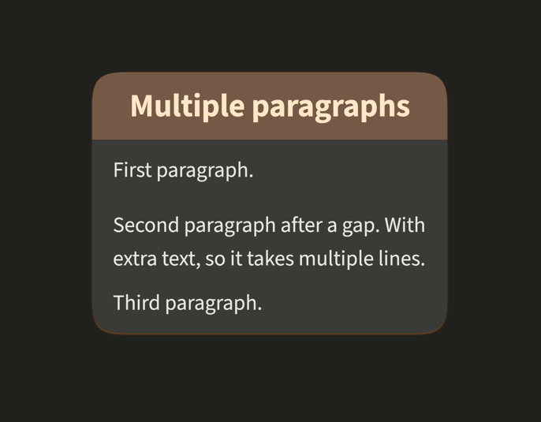

### Heading, hyperlink, and blockquote

Unit content supports one heading level, normal hyperlinks, and block quotes.

In HTML:

```html
<h4>Useful resources</h4>
<p>
    Visit the <a href="https://orgpad.info">OrgPad website</a>
    and add your own notes.
</p>
<blockquote>
    Important copied text can be placed in a block quote.
</blockquote>
```

In Hiccup:

```clojure
[[:h4 "Useful resources"]
 [:p "Visit the " [:a {:href "https://orgpad.info"}
                   "OrgPad website"]
  " and add your own notes."]
 [:blockquote "Important copied text can be placed in a block quote."]]
```

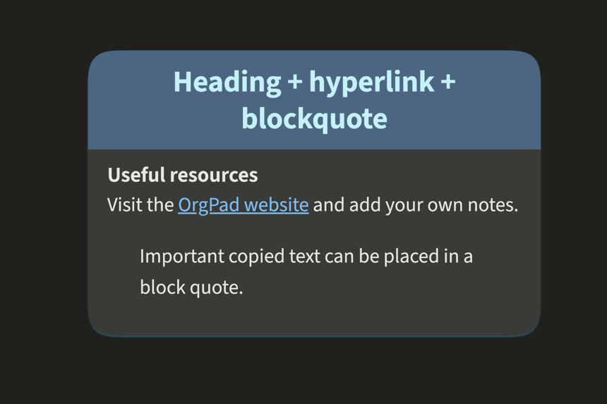

### Text highlighting

Use `mark` with an OrgPad color to highlight inline text.

In HTML:

```html
<p>
    In OrgPad, it is possible to
    <mark color="yellow">highlight text</mark>
    with
    <mark color="orchid">12 different colors</mark>
    using
    <mark color="green">mark tags</mark>
    .
</p>
```

In Hiccup:

```clojure
[[:p "In OrgPad, it is possible to "
  [:mark {:mark/color :color/yellow} "highlight text"] " with "
  [:mark {:mark/color :color/orchid} "12 different colors"] " using "
  [:mark {:mark/color :color/green} "mark tags"] "."]]
```

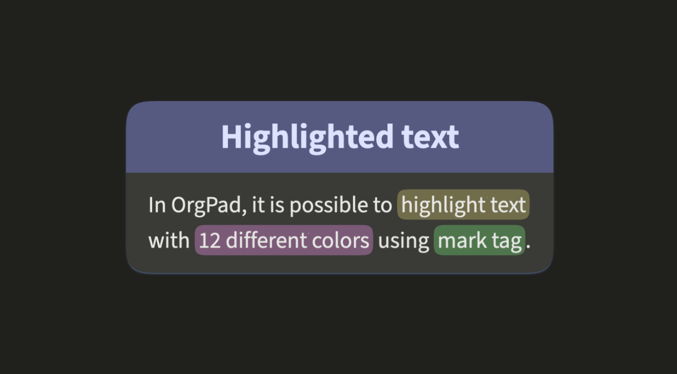

### Unordered list

In HTML, the unordered list content is:

```html
<p>This API documentation includes:</p>
<ul>
    <li>API keys,</li>
    <li>endpoints,</li>
    <li>OrgPage data format.</li>
</ul>
```

In Hiccup, the unordered list content is:

```clojure
[[:p "This API documentation includes:"]
 [:ul [:li "API keys,"]
  [:li "endpoints,"]
  [:li "OrgPage data format."]]]
```

### Ordered list

In Hiccup, the ordered list content is:

```html
<p>Follow these steps:</p>
<ol>
    <li>Upload attachments.</li>
    <li>Create or update page content.</li>
    <li>Connect the new cells with links.</li>
</ol>
```

The ordered list content is:

```clojure
[[:p "Follow these steps:"]
 [:ol [:li "Upload attachments."]
  [:li "Create or update page content."]
  [:li "Connect the new cells with links."]]]
```

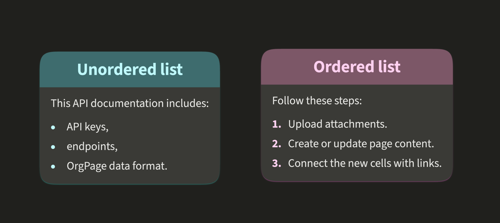

### Table

Use tables for simple tabular content. Tables are stored as regular HTML table elements.

In HTML:

```html
<table border="1">
    <thead>
    <tr>
        <th>Name</th>
        <th>Status</th>
    </tr>
    </thead>
    <tbody>
    <tr>
        <td>API documentation</td>
        <td>Draft</td>
    </tr>
    </tbody>
</table>
```

In Hiccup:

```clojure
[[:p
  [:table {:border "1"}
   [:thead [:tr [:th "Name"]
            [:th "Status"]]]
   [:tbody [:tr [:td "API documentation"]
            [:td "Draft"]]]]]]
```

Table rendering will be improved in future OrgPad versions.

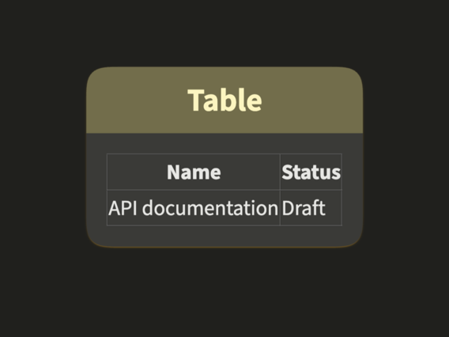

### Image

Use `img` for images uploaded to OrgPad. The `dm-src` attribute specifies a separate image source for dark mode.

In HTML:

```html
<p>
    In Pascal's triangle, each number is formed by summing the two numbers above it.
    It has beautiful structure and many surprising patterns.
</p>
<p>
    
</p>
```

In Hiccup:

```clojure
[[:p "In Pascal's triangle, each number is formed by summing the two numbers above it. It has beautiful structure and many surprising patterns."]
 [:p [:img {:width  "370"
            :height "370"
            :src    "/img/DEBwDAe1tM9omDMbRIP1Mb"
            :dm-src "/img/CJpejrnQZFFYNM1B4A_DHe"}]]]
```

For security reasons, unit content can display only images uploaded to OrgPad, not arbitrary external images.

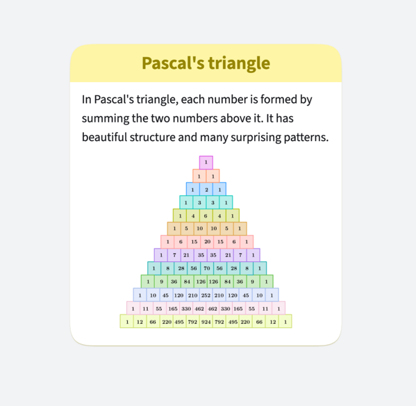
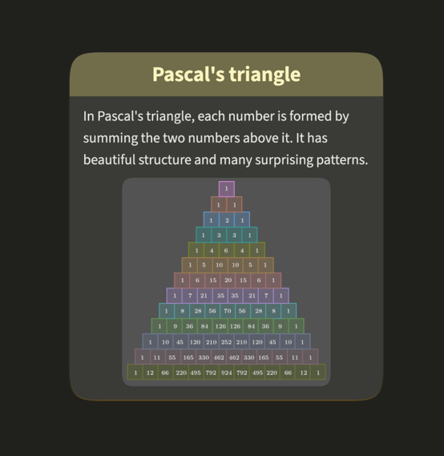

### Attached file

In stored unit content, an attached file is shown as a normal hyperlink with the file icon and filename. Use this form
when a unit links to an uploaded file instead of embedding a file preview.

When sending new content through the API, you can write this hyperlink directly or use the custom `file` helper tag
from [File Helpers](ops_content.md#file-helpers). The API converts the helper into the same hyperlink form.

In HTML:

```html
<p>
    OrgPad is great for visual file storage:
</p>
<p>
    <a href="/file/A1wzY1upVBw5SBwTeHWt8k">
        
        Binomial_theorem.pdf
    </a>
</p>
```

In Hiccup:

```clojure
[[:p "OrgPad is great for visual file storage:"]
 [:p
  [:a
   {:href "/file/A1wzY1upVBw5SBwTeHWt8k"}
   [:img {:width  "24"
          :src    "/static/img/files/pdf.svg"
          :style  {:vertical-align "text-bottom"
                   :margin-right   "4px"
                   :margin-bottom  "6px"}
          :height "24"}]
   "Binomial_theorem.pdf"]]]
```

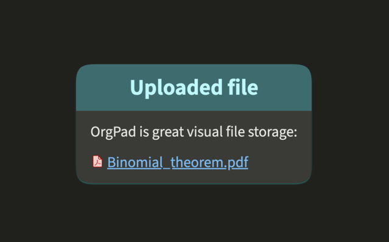

### Embed

Use `embed` for embedded websites or uploaded files represented by an OrgPage embed object.

In HTML:

```html
<p>
    <embed id="7a4cd0cf-33a8-46a7-8056-9b23a1db6e49"
           width="700" height="450"></embed>
</p>
```

In Hiccup:

```clojure
[[:p [:embed {:embed/id     #uuid "7a4cd0cf-33a8-46a7-8056-9b23a1db6e49"
              :embed/width  700
              :embed/height 450}]]]
```

The content is linked to an [embed object](orgpage.md#embeds), which can embed an external website or an uploaded file
when the file is a PDF, Word, Excel, or PowerPoint document.

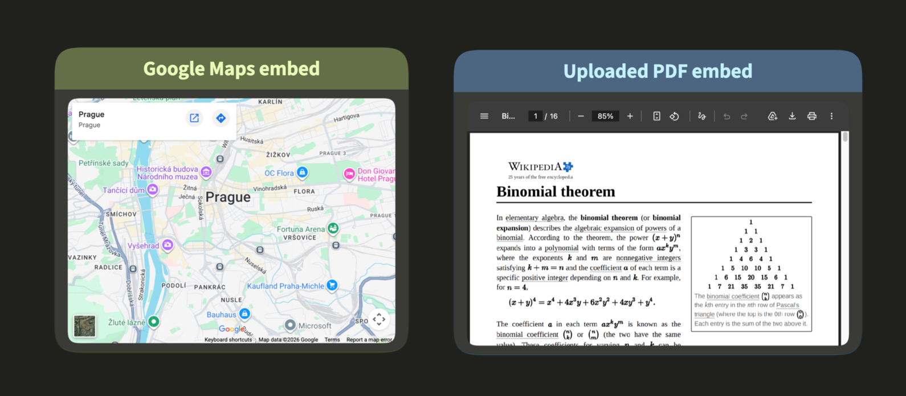

External websites can be embedded only when the target site allows its pages to be shown inside an iframe. In practice,
the site must not block embedding with headers such as `X-Frame-Options` or a restrictive `Content-Security-Policy`
`frame-ancestors` directive.

External PDF files cannot be embedded directly. OrgPad uses a `sandbox` attribute on external embeds, and browser PDF
viewers do not work reliably in sandboxed iframes. This does not apply to PDF files uploaded to OrgPad where sandbox is
turned off. See the related [WHATWG HTML issue](https://github.com/whatwg/html/issues/3958).

### Embedded OrgPage

Use the custom `orgpage` tag to show another OrgPage inside the unit.

In HTML:

```html
<p>
    Embedded OrgPage about OrgPad's IT infrastructure:
</p>
<p>
    <orgpage id="b1d2da1a-01b9-4aa4-a512-65ab03c6cc4a"
             token="ed377ebf-5c12-46a8-a85d-264da9c25d59"
             query-params="s:it-architecture;"
             width="700" height="395"></orgpage>
</p>
```

In HTML, `query-params` uses CSS-style formatting: `name:value` pairs separated by semicolons.

In Hiccup:

```clojure
[[:p "Embedded OrgPage about OrgPad's IT infrastructure:"]
 [:p [:orgpage {:orgpage/id           #uuid "b1d2da1a-01b9-4aa4-a512-65ab03c6cc4a"
                :orgpage/token        #uuid "ed377ebf-5c12-46a8-a85d-264da9c25d59"
                :orgpage/query-params {:s "it-architecture"}
                :orgpage/width        700
                :orgpage/height       395}]]]
```

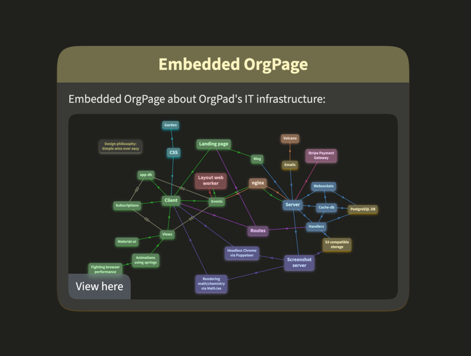

An embedded OrgPage can point to the whole document, a specific presentation path, or a specific fragment. It can also be
based on a short link. When a short link already points to a fragment, an explicitly supplied fragment overrides the
fragment from the short link.

In HTML:

```html
<p>
  <orgpage short-link="orgpage-data-example"
           path-id="7797a367-2600-4ab2-9fa9-0f21f1347216"
           fragment="pascal-video"
           width="700" height="395"></orgpage>
</p>
```

In Hiccup:

```clojure
[[:p [:orgpage {:orgpage/short-link "orgpage-data-example"
                :orgpage/fragment   "pascal-video"
                :orgpage/path-id    #uuid "7797a367-2600-4ab2-9fa9-0f21f1347216"
                :orgpage/width      700
                :orgpage/height     395}]]]
```

### Video

Use `video` with a nested `source` to play an uploaded OrgPad video file in the unit.

In HTML:

```html
<p>
    <video controls="controls"
           loop="loop"
           muted="muted"
           width="600"
           height="376">
        <source src="/file/AkZMAJ99lOsojTwUENEIP3?token=BJAxvHqBxLA4ya9aMuZZbk"/>
    </video>
</p>
```

In Hiccup:

```clojure
[[:p [:video {:controls true
              :loop     true
              :muted    true
              :width    600
              :height   376}
      [:source {:src "/file/AkZMAJ99lOsojTwUENEIP3?token=BJAxvHqBxLA4ya9aMuZZbk"}]]]]
```

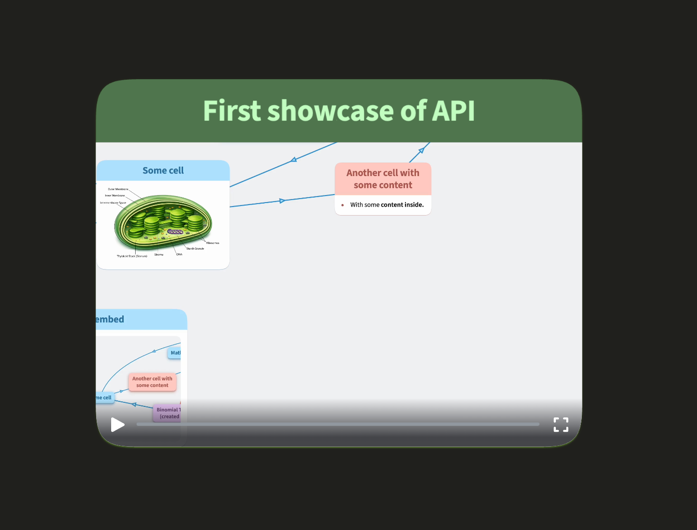

Video dimensions are specified with `width` and `height`. Video supports `controls`, `auto-play`, `loop`, and `muted`.

### Audio

Use `audio` with a nested `source` to play an uploaded OrgPad audio file in the unit.

In HTML:

```html
<p>
    Audio files are playable directly inside OrgPad.
</p>
<p>
    <audio controls="controls"
           loop="loop">
        <source src="/file/CcGoP957JDDqAHabZQ1dOW?token=A7ap89yptOqIF0UC_VrO2N"/>
    </audio>
</p>
```

In Hiccup:

```clojure
[[:p "Audio files are playable directly inside OrgPad."]
 [:p [:audio {:controls true
              :loop     true}
      [:source {:src "/file/CcGoP957JDDqAHabZQ1dOW?token=A7ap89yptOqIF0UC_VrO2N"}]]]]
```

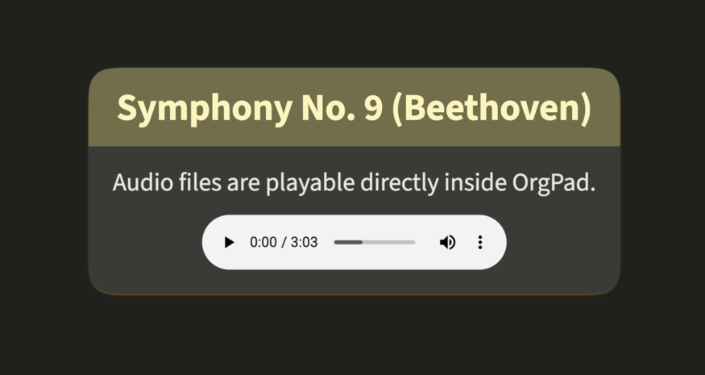

Audio supports `controls`, `auto-play`, and `loop`.

### YouTube video

Use the custom `youtube` tag for stored YouTube embeds.

In HTML:

```html
<p>
    Here is a YouTube video about complex numbers:
</p>
<p>
    <youtube id="YYcJ49dIVEo" width="560" height="314"
             query-params="start:60;end:120;autoplay:1;loop:1;playlist:YYcJ49dIVEo;"></youtube>
</p>
```

In HTML, `query-params` uses CSS-style formatting: `name:value` pairs separated by semicolons.

In Hiccup:

```clojure
[[:p "Here is a YouTube video about complex numbers:"]
 [:p [:youtube {:youtube/id           "YYcJ49dIVEo"
                :youtube/width        560
                :youtube/height       314
                :youtube/query-params {:start    60
                                       :end      120
                                       :autoplay 1
                                       :loop     1
                                       :playlist "YYcJ49dIVEo"}}]]]
```


YouTube content supports `width`, `height`, and YouTube playback query parameters. Use `start` and `end` values in
seconds. Setting `autoplay=1` starts the YouTube embed directly and skips OrgPad's custom thumbnail. For looping, YouTube
requires both `loop=1` and `playlist` set to the same video ID.

### Math and Chemistry

For math and chemistry, use [math objects](orgpage.md#maths) and reference them from the content. Stored unit content
uses the `math` tag with the math object ID. Chemistry formulas are stored the same way; the referenced math object
contains the `math/chemistry` type.

In HTML:

```html
<p>OrgPad allows inserting math and chemistry rendered by MathJax.</p>
<p>
    It can appear inline as
    <math id="5d43d5cb-d187-426c-be78-da8596565d67"></math>
    or as a block:
</p>
<p>
    <math id="6973f3f1-423e-40e1-a9db-b479d72111d1"></math>
</p>
<p>
    It also allows formatting of chemistry, for example
    <math id="50192b9e-379c-4560-b029-47fd7fd3e356"></math>.
</p>
```

In Hiccup:

```clojure
[[:p "OrgPad allows inserting math and chemistry rendered by MathJax."]
 [:p "It can appear inline as "
  [:math {:math/id #uuid "5d43d5cb-d187-426c-be78-da8596565d67"}]
  " or as a block:"]
 [:p [:math {:math/id #uuid "6973f3f1-423e-40e1-a9db-b479d72111d1"}]]
 [:p "It also allows formatting of chemistry, for example "
  [:math {:math/id #uuid "50192b9e-379c-4560-b029-47fd7fd3e356"}] "."]]
```

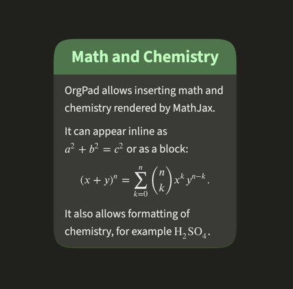

The referenced [math objects](orgpage.md#maths) look like this in JSON:

```json
[
  {
    "id": "5d43d5cb-d187-426c-be78-da8596565d67",
    "pageId": "bab9dbf7-4c82-4171-8bd0-b67fbb5114d7",
    "type": "math/math",
    "block": false,
    "source": "a^2+b^2=c^2",
    "width": 11.894,
    "height": 2.509,
    "verticalAlign": -0.338,
    "svg": "<svg>…</svg>"
  },
  {
    "id": "50192b9e-379c-4560-b029-47fd7fd3e356",
    "pageId": "bab9dbf7-4c82-4171-8bd0-b67fbb5114d7",
    "type": "math/math",
    "block": false,
    "source": "\\ce{H2SO4}",
    "width": 6.757,
    "height": 2.843,
    "verticalAlign": -1.005,
    "svg": "<svg>…</svg>"
  },
  {
    "id": "6973f3f1-423e-40e1-a9db-b479d72111d1",
    "pageId": "bab9dbf7-4c82-4171-8bd0-b67fbb5114d7",
    "type": "math/math",
    "block": true,
    "source": "(x+y)^n = \\sum_{k=0}^n {n \\choose k} x^k y^{n-k}.",
    "width": 25.875,
    "height": 7.176,
    "verticalAlign": -3.171,
    "svg": "<svg>…</svg>"
  }
]
```

In EDN:

```clojure
[{:math/id             #uuid "5d43d5cb-d187-426c-be78-da8596565d67"
  :math/page-id        #uuid "bab9dbf7-4c82-4171-8bd0-b67fbb5114d7"
  :math/type           :math/math
  :math/block          false
  :math/source         "a^2+b^2=c^2"
  :math/width          11.894
  :math/height         2.509
  :math/vertical-align -0.338
  :math/svg            "<svg>…</svg>"}
 {:math/id             #uuid "50192b9e-379c-4560-b029-47fd7fd3e356"
  :math/page-id        #uuid "bab9dbf7-4c82-4171-8bd0-b67fbb5114d7"
  :math/type           :math/math
  :math/block          false
  :math/source         "\\ce{H2SO4}"
  :math/width          6.757
  :math/height         2.843
  :math/vertical-align -1.005
  :math/svg            "<svg>…</svg>"}
 {:math/id             #uuid "6973f3f1-423e-40e1-a9db-b479d72111d1"
  :math/page-id        #uuid "bab9dbf7-4c82-4171-8bd0-b67fbb5114d7"
  :math/type           :math/math
  :math/block          true
  :math/source         "(x+y)^n = \\sum_{k=0}^n {n \\choose k} x^k y^{n-k}."
  :math/width          25.875
  :math/height         7.176
  :math/vertical-align -3.171
  :math/svg            "<svg>…</svg>"}]
```

### Code

Code can be inline or block-level. OrgPad uses the `code` tag for both forms.
Block code is marked with the `block` attribute in HTML or `:code/block` in Hiccup. Unlike Markdown,
inline code in OrgPad can also use syntax highlighting.

Code content can include regular inline formatting, such as bold text, italic text, and highlighting.
It can also include math and chemistry formulas, which is useful for code that performs mathematical or
scientific computations. For a visual overview, see [Code Highlighting in OrgPad](https://orgpad.info/blog/code-highlighting).

When sending content through the API, you can also use `pre` as an input helper. The API automatically converts it to block code.

In HTML:

```html
<p>
  Use <code>unit/create</code> to create a new cell.
  Inline code can be highlighted too:
  <code lang="json">{&quot;type&quot;:&quot;book&quot;}</code>.
</p>
<code block lang="clojure">[:unit/create {:unit/type :unit/book<br /> :unit/title <strong>&quot;Important cell&quot;</strong>}]</code>
<p>It is also possible to use formatting inside code, including math:</p>
<code block>Plain preformatted text with <em>emphasis</em>, <mark color="yellow">highlighting</mark>, and <math id="6f1d2f1a-789b-498b-b29b-9fec0625dadf"></math>.</code>
```

In Hiccup:

```clojure
[[:p "Use "
  [:code "unit/create"]
  " to create a new cell. Inline code can be highlighted too: "
  [:code {:code/lang :code-lang/json} "{\"type\":\"book\"}"]
 "."]
 [:code {:code/block true
         :code/lang :code-lang/clojure}
  "[:unit/create {:unit/type :unit/book"
  [:br]
  " :unit/title " [:strong "\"Important cell\""] "}]"]
 [:p "It is also possible to use formatting inside code:"]
 [:code {:code/block true}
  "Plain preformatted text with " [:em "emphasis"]
  ", " [:mark #:mark{:color :color/yellow} "highlighting"]
 ", and " [:math {:math/id #uuid "6f1d2f1a-789b-498b-b29b-9fec0625dadf"}] "."]]
```

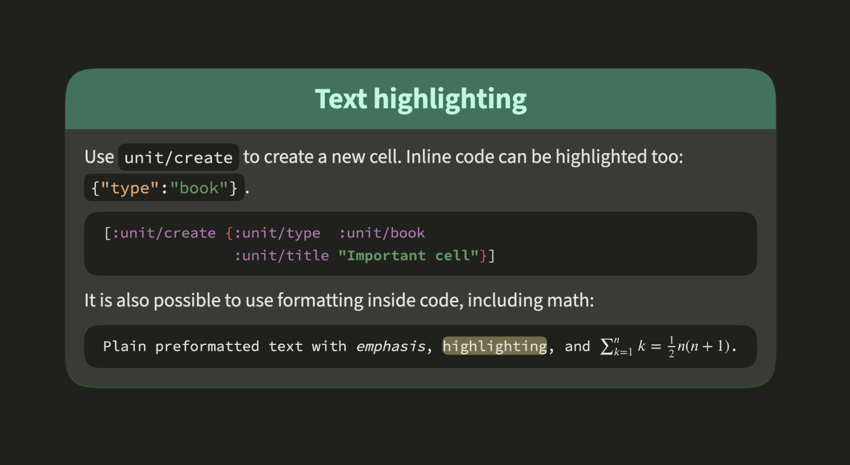

#### Supported code highlighting languages

| Language key | Display name | Accepted language names                                             |
|--------------|--------------|---------------------------------------------------------------------|
| `asm`        | Assembly     | `asm`, `assembly`, any value containing `asm`, `assembly`, or `arm` |
| `bash`       | Bash         | `bash`, `sh`, `zsh`                                                 |
| `clojure`    | Clojure      | `clojure`                                                           |
| `cpp`        | C/C++        | `c`, `cpp`, `c++`, `cxx`, `cplusplus`                               |
| `csharp`     | C#           | `cs`, `csharp`, `c-sharp`, `c#`                                     |
| `cshtml`     | C# HTML      | `cshtml`, `c#html`, `razor`                                         |
| `css`        | CSS          | `css`                                                               |
| `dart`       | Dart         | `dart`                                                              |
| `dockerfile` | Dockerfile   | `dockerfile`                                                        |
| `elixir`     | Elixir       | `elixir`                                                            |
| `excel`      | Excel        | `excel`, `xls`, `xlsx`                                              |
| `f-sharp`    | F#           | `f-sharp`, `fsharp`, `f#`                                           |
| `glsl`       | GLSL         | `glsl`, `hlsl`                                                      |
| `go`         | Go           | `go`                                                                |
| `haskell`    | Haskell      | `haskell`                                                           |
| `java`       | Java         | `java`                                                              |
| `javascript` | JavaScript   | `javascript`, `js`, `jsx`                                           |
| `json`       | JSON         | `json`, `json5`, `jsonc`                                            |
| `kotlin`     | Kotlin       | `kotlin`                                                            |
| `latex`      | LaTeX        | `latex`                                                             |
| `lean`       | Lean         | `lean`                                                              |
| `lisp`       | Lisp         | `lisp`                                                              |
| `lua`        | Lua          | `lua`                                                               |
| `matlab`     | MATLAB       | `matlab`                                                            |
| `modelica`   | Modelica     | `modelica`                                                          |
| `ocaml`      | OCaml        | `ocaml`                                                             |
| `perl`       | Perl         | `perl`                                                              |
| `php`        | PHP          | `php`                                                               |
| `powershell` | PowerShell   | `powershell`                                                        |
| `prolog`     | Prolog       | `prolog`                                                            |
| `python`     | Python       | `python`, `py`                                                      |
| `r`          | R            | `r`                                                                 |
| `ruby`       | Ruby         | `ruby`                                                              |
| `rust`       | Rust         | `rust`                                                              |
| `scala`      | Scala        | `scala`                                                             |
| `sql`        | SQL          | `sql`, any value containing `sql`                                   |
| `swift`      | Swift        | `swift`                                                             |
| `typescript` | TypeScript   | `typescript`, `ts`, `tsx`                                           |
| `vb`         | Visual Basic | `vb`                                                                |
| `xml`        | HTML/XML     | `xml`, `html`, `xhtml`, `html5`                                     |
| `yaml`       | YAML         | `yaml`, `yml`                                                       |

When parsing language names from HTML, OrgPad ignores the `language-`, `lang-`, and `code-lang-` prefixes and matches
case-insensitively. For example, `language-js`, `LANG-JS`, and `js` all parse as `javascript`. In EDN, use the
`:code-lang/…` prefix.

## Related Pages

Use these pages when stored unit content connects to API input, operations, or attachments.

| Page                                         | When to use it                                                             |
|----------------------------------------------|----------------------------------------------------------------------------|
| [Unit content in operations](ops_content.md) | Send content through the API with formats and helper tags.                 |
| [Operations](ops.md)                         | Use unit content in `unit/create` and `unit/update`.                       |
| [Attachments](attachments.md)                | Upload and download files and images used in unit content.                 |
| [OrgPage data](orgpage.md)                   | Understand units, files, images, maths, embeds, fragments, and paths.      |
| [API cookbook](cookbook.md)                  | See practical examples using unit content.                                 |
