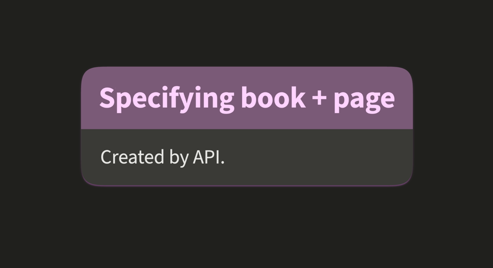

# Operations

Operations allow most changes inside OrgPages: creating, updating, and deleting units, links, and related objects.
OrgPad currently supports 36 operations, so the operations endpoint is quite involved, but it is also very powerful.

For stored content tags and examples, see [Unit content](content.md). For operation input formats, helper tags, and
content-specific errors, see [Unit content in operations](ops_content.md).

## Contents

- [Structure of Operations](#structure-of-operations)
- [Operations Endpoint](#operations-endpoint)
  - [IDs and text IDs](#ids-and-text-ids)
  - [General errors](#general-errors)
- [Operation Summary](#operation-summary)
- [Unit Operations](#unit-operations)
- [Link Operations](#link-operations)
- [OrgPage Operations](#orgpage-operations)
- [Math Operations](#math-operations)
- [Embed Operations](#embed-operations)
- [Fragment Operations](#fragment-operations)
- [Path Operations](#path-operations)
- [Unit Content in Operations](#unit-content-in-operations)
- [Automatic Behavior](#automatic-behavior)
- [Examples](#examples)
- [Related Pages](#related-pages)

## Structure of Operations

Each operation is a two-element vector. In JSON, the first element is the operation name as a string. The second element
is an object with operation parameters. For example, the following operation creates a new blue book at the origin:

```json
[
  "unit/create",
  {
    "title": "New book",
    "pos": [
      0,
      0
    ]
  }
]
```

In EDN, the operation name is a namespaced keyword. The same operation is written as:

```clojure
[:unit/create {:unit/title "New book"
               :unit/pos   [0 0]}]
```

## Operations Endpoint

Use the operations endpoint to apply changes to an OrgPage. The request body is a vector of operations.
The API key must have edit permission for the target OrgPage.

```http
POST https://orgpad.info/api/v1/o/{orgpage-id}/ops
POST https://orgpad.info/api/v1/s/{short-link}/ops
```

For example, the following JSON request creates two books and connects them with a link:

```json
[
  [
    "unit/create",
    {
      "textId": "first-cell",
      "pos": [
        0,
        0
      ],
      "title": "First cell",
      "content": "<p>Hello from the API.</p>"
    }
  ],
  [
    "unit/create",
    {
      "textId": "second-cell",
      "pos": [
        360,
        0
      ],
      "title": "Second cell",
      "content": "<p>This cell is <b>connected</b> to the first one.</p>"
    }
  ],
  [
    "link/create",
    {
      "endpointIds": [
        "first-cell",
        "second-cell"
      ]
    }
  ]
]
```

The equivalent EDN body is:

```clojure
[[:unit/create {:unit/text-id "first-cell"
                :unit/pos     [0 0]
                :unit/title   "First cell"
                :unit/content [[:p "Hello from the API."]]}]
 [:unit/create {:unit/text-id "second-cell"
                :unit/pos     [360 0]
                :unit/title   "Second cell"
                :unit/content [[:p "This cell is " [:b "connected"] " to the first one."]]}]
 [:link/create {:link/endpoint-ids ["first-cell" "second-cell"]}]]
```


The endpoint validates and expands operations before applying them. For example, the single `unit/create` operation
above creates both a book and its page, so it expands into two internal `unit/create` operations:
one for the book and one for the page. During expansion, the API generates missing IDs, resolves text IDs, sets default
props, and fills in other defaults. This keeps API requests compact and avoids unnecessary client-side bookkeeping.

On success, the response returns the expanded list of operations that were applied.

JSON response:

```json
{
  "id": "66edb4e3-61c4-4751-a3b5-c2e2968d887b",
  "list": [
    [
      "unit/create",
      {
        "id": "9efa36a5-0e87-4dc3-bab8-af01520389fa",
        "textId": "first-cell",
        "type": "unit/book",
        "childUnitIds": [
          "01b93554-c3c1-45d3-86ef-a1000da7b7f8"
        ],
        "pos": [
          0,
          0
        ],
        "title": "First cell",
        "props": {
          "titleSize": "props/h2",
          "color": "color/blue"
        }
      }
    ],
    [
      "unit/create",
      {
        "id": "01b93554-c3c1-45d3-86ef-a1000da7b7f8",
        "type": "unit/page",
        "parentId": "9efa36a5-0e87-4dc3-bab8-af01520389fa",
        "content": "<p>Hello from the API.</p>"
      }
    ],
    [
      "unit/create",
      {
        "id": "cf906a3a-c9c0-4194-93ca-cc96f5c7a396",
        "textId": "second-cell",
        "type": "unit/book",
        "childUnitIds": [
          "d4f1069f-cf9e-4948-980b-a0a61baea716"
        ],
        "pos": [
          360,
          0
        ],
        "title": "Second cell",
        "props": {
          "titleSize": "props/h2",
          "color": "color/blue"
        }
      }
    ],
    [
      "unit/create",
      {
        "id": "d4f1069f-cf9e-4948-980b-a0a61baea716",
        "type": "unit/page",
        "parentId": "cf906a3a-c9c0-4194-93ca-cc96f5c7a396",
        "content": "<p>This cell is <strong>connected</strong> to the first one.</p>"
      }
    ],
    [
      "link/create",
      {
        "id": "9abd8b3f-4ab3-4c00-be1d-d3e4dd4aa70d",
        "endpointIds": [
          "9efa36a5-0e87-4dc3-bab8-af01520389fa",
          "cf906a3a-c9c0-4194-93ca-cc96f5c7a396"
        ],
        "props": {
          "arrowhead": "props/single",
          "color": "color/blue"
        }
      }
    ]
  ]
}
```

EDN response:

```clojure
#:ops{:id   #uuid "66edb4e3-61c4-4751-a3b5-c2e2968d887b"
      :list [[:unit/create #:unit{:id             #uuid "9efa36a5-0e87-4dc3-bab8-af01520389fa"
                                  :text-id        "first-cell"
                                  :type           :unit/book
                                  :child-unit-ids [#uuid "01b93554-c3c1-45d3-86ef-a1000da7b7f8"]
                                  :pos            [0 0]
                                  :title          "First cell"
                                  :props          #:props{:title-size :props/h2
                                                          :color      :color/blue}}]
             [:unit/create #:unit{:id        #uuid "01b93554-c3c1-45d3-86ef-a1000da7b7f8"
                                  :type      :unit/page
                                  :parent-id #uuid "9efa36a5-0e87-4dc3-bab8-af01520389fa"
                                  :content   [[:p "Hello from the API."]]}]
             [:unit/create #:unit{:id             #uuid "cf906a3a-c9c0-4194-93ca-cc96f5c7a396"
                                  :text-id        "second-cell"
                                  :type           :unit/book
                                  :child-unit-ids [#uuid "d4f1069f-cf9e-4948-980b-a0a61baea716"]
                                  :pos            [360 0]
                                  :title          "Second cell"
                                  :props          #:props{:title-size :props/h2
                                                          :color      :color/blue}}]
             [:unit/create #:unit{:id        #uuid "d4f1069f-cf9e-4948-980b-a0a61baea716"
                                  :type      :unit/page
                                  :parent-id #uuid "cf906a3a-c9c0-4194-93ca-cc96f5c7a396"
                                  :content   [[:p "This cell is " [:strong "connected"] " to the first one."]]}]
             [:link/create #:link{:id           #uuid "9abd8b3f-4ab3-4c00-be1d-d3e4dd4aa70d"
                                  :endpoint-ids [#uuid "9efa36a5-0e87-4dc3-bab8-af01520389fa"
                                                 #uuid "cf906a3a-c9c0-4194-93ca-cc96f5c7a396"]
                                  :props        #:props{:arrowhead :props/single
                                                        :color     :color/blue}}]]}
```

Notice that the `second-cell` content is normalized in the response: the `b` tag is replaced with `strong`. This is
part of unit content processing. For details, see [Unit content in operations](ops_content.md).

With `dry-run=true`, the operations are validated and expanded but not applied. This is useful for testing changes
without modifying OrgPage data. The response has the same shape and also includes `"dryRun": true` in JSON or
`:ops/dry-run true` in EDN.

### IDs and text IDs

Operation payloads accept several ID forms:

- Standard UUID strings, such as `0713d2bf-8e70-41e2-8b81-c8ca3ef4a8cd`.
- OrgPad compact base64 UUID strings, such as `AHE9K_jnBB4ouByMo-9KjN`.
- Native UUID values in EDN and Transit payloads.
- Text IDs already present in the OrgPage.
- Text IDs introduced earlier or later in the same operation batch. Text IDs are supported for units, embeds, and
  fragments.

For the general text ID rules, see [Text IDs](formats.md#text-ids). This section only summarizes how operation payloads
resolve IDs.

### General errors

The following [errors](errors.md#id-and-operation-errors) can happen across operation types:

- `body-schema-error`: the operation payload has missing required fields, unsupported enum values, invalid field values,
  invalid text IDs, or fields not accepted by the selected operation.
- `invalid-id`: an ID cannot be parsed. This includes invalid UUID strings and unresolved text IDs.
- `unknown-id`: a parsed ID does not match an existing object or an object created in the same operation batch.
- `wrong-id-type`: an ID points to a different object type than expected.
- `duplicate-text-id`: a text ID is already used by another unit, embed, or fragment. Text IDs must be unique across
  the OrgPage.
- `id-already-exists`: a create operation uses an ID that already exists.
- `op-for-removed-id`: an operation references an object that is also removed in the same operation batch. Including
  both operations is usually a sign that the operation list was constructed incorrectly.

## Operation Summary

| Area                                     | Operations                                                                                                                                             | Purpose                                                                                                |
|------------------------------------------|--------------------------------------------------------------------------------------------------------------------------------------------------------|--------------------------------------------------------------------------------------------------------|
| [Units](#unit-operations)                | `unit/create`, `unit/update`, `unit/remove`, `unit/move`, `unit/change-props`, `unit/add-child-unit`, `unit/remove-child-unit`, `unit/move-child-unit` | Create and edit books and pages, move books, update visual properties, and manage pages inside books.  |
| [Links](#link-operations)                | `link/create`, `link/remove`, `link/straighten`, `link/flip`, `link/change-props`                                                                      | Create, remove, orient, and style links between books.                                                 |
| [OrgPage](#orgpage-operations)           | `orgpage/update-meta`, `orgpage/add-image`, `orgpage/remove-image`, `orgpage/add-file`, `orgpage/remove-file`                                          | Update OrgPage metadata and manage attached [images](orgpage.md#images) and [files](orgpage.md#files). |
| [Math](#math-operations)                 | `math/create`, `math/update`, `math/remove`                                                                                                            | Create, update, and remove rendered math and chemistry objects used inside page content.               |
| [Embeds](#embed-operations)              | `embed/create`, `embed/update`, `embed/remove`                                                                                                         | Create, update, and remove URL or file embeds used inside page content.                                |
| [Fragments](#fragment-operations)        | `fragment/create`, `fragment/update`, `fragment/update-units`, `fragment/remove`                                                                       | Manage saved OrgPage locations and their visible or hidden unit state.                                 |
| [Paths](#path-operations)                | `path/create`, `path/update-title`, `path/remove`, `path/add-step`, `path/remove-step`, `path/update-units`, `path/set-audio`, `path/move-step`        | Manage presentations and their ordered steps.                                                          |

## Unit Operations

Book and page units together form cells in OrgPages; refer to [Units](orgpage.md#units) for their fields. Unit operations
allow creating, updating, and deleting units.

- [Creating units](#creating-units)
- [Updating units](#updating-units)
- [Removing units](#removing-units)
- [Moving books](#moving-books)
- [Changing book look](#changing-book-look)
- [Managing pages in a book](#managing-pages-in-a-book)
  - [Adding pages](#adding-pages)
  - [Removing pages](#removing-pages)
  - [Reordering pages](#reordering-pages)

### Creating units

Units are created with `unit/create` operations. The created unit type is specified in the `type` field. Explicit unit
creation supports two types: `unit/book` and `unit/page`. An explicit `unit/create` operation creates exactly one unit.

For books, `unit/create` accepts these fields:

- `id` (optional): ID of the new book. If omitted, OrgPad generates a new UUID.
- `textId` (optional): text ID of the book. It must be unique within the OrgPage. It can be used as an ID replacement in
  the same operation batch and in future operations.
- `type` (**required**): must be `unit/book`.
- `pos` (**required**): position of the book on the canvas as `[x, y]`. Both coordinates are floats between -1,000,000 and
  1,000,000. The `x` coordinate grows to the right and the `y` coordinate grows downward.
- `childUnitIds` (**required**): vector of page IDs or text IDs contained in the book. Each referenced page must be
  created in the same operation batch and must point back to this book through its `parentId`. Existing pages cannot be
  moved from another book by creating a new book with their IDs.
- `title` (optional): book title.
- `props` (optional): visual properties of the book.
  - `titleSize` is `props/h1`, `props/h2`, or `props/h3`. When omitted, it defaults to `props/h2`.
  - `color` is one of the supported [OrgPad colors](orgpage.md#colors). When omitted, it defaults to `color/blue`.

For pages, `unit/create` accepts these fields:

- `id` (optional): ID of the new page. If omitted, OrgPad generates a new UUID.
- `textId` (optional): text ID of the page. It must be unique within the OrgPage. It can be used as an ID replacement in
  the same operation batch and in future operations.
- `type` (**required**): must be `unit/page`.
- `parentId` (**required**): ID or text ID of the parent book. The parent book must also contain this page in its
  `childUnitIds`, either because the book is created in the same batch or because the batch also includes
  `unit/add-child-unit`. This allows creating a new page inside an existing book.
- `content` (optional): page content. In JSON, this is usually an HTML string. In EDN, this is usually vector
  of [Hiccup nodes](ops_content.md#hiccup). For details, see [Unit content in operations](ops_content.md).
- `contentType` (optional): content format. Supported values are `hiccup`, `html`, `plain`, and `markdown`. For JSON,
  the API defaults to HTML. For EDN, it defaults to Hiccup.

JSON example creating a single book and its page:

```json
[
  [
    "unit/create",
    {
      "id": "9efa36a5-0e87-4dc3-bab8-af01520389fa",
      "textId": "book",
      "type": "unit/book",
      "childUnitIds": [
        "01b93554-c3c1-45d3-86ef-a1000da7b7f8"
      ],
      "pos": [
        150,
        210
      ],
      "title": "Specifying book + page",
      "props": {
        "color": "color/orchid"
      }
    }
  ],
  [
    "unit/create",
    {
      "id": "01b93554-c3c1-45d3-86ef-a1000da7b7f8",
      "textId": "page",
      "type": "unit/page",
      "parentId": "9efa36a5-0e87-4dc3-bab8-af01520389fa",
      "content": "<p>Created by API.</p>"
    }
  ]
]
```

EDN example:

```clojure
[[:unit/create {:unit/id             #uuid "9efa36a5-0e87-4dc3-bab8-af01520389fa"
                :unit/text-id        "book"
                :unit/type           :unit/book
                :unit/child-unit-ids [#uuid "01b93554-c3c1-45d3-86ef-a1000da7b7f8"]
                :unit/pos            [150 210]
                :unit/title          "Specifying book + page"
                :unit/props          {:props/color :color/orchid}}]
 [:unit/create {:unit/id        #uuid "01b93554-c3c1-45d3-86ef-a1000da7b7f8"
                :unit/text-id   "page"
                :unit/type      :unit/page
                :unit/parent-id #uuid "9efa36a5-0e87-4dc3-bab8-af01520389fa"
                :unit/content   [[:p "Created by API."]]}]]
```



You can also omit generated IDs and connect the created units with text IDs. Text IDs can refer to other text IDs in the
same operation batch, including circular references that point both ways between a book and its page.

In JSON:

```json
[
  [
    "unit/create",
    {
      "textId": "book",
      "type": "unit/book",
      "childUnitIds": [
        "page"
      ],
      "pos": [
        150,
        210
      ],
      "title": "Specifying book + page",
      "props": {
        "color": "color/orchid"
      }
    }
  ],
  [
    "unit/create",
    {
      "textId": "page",
      "type": "unit/page",
      "parentId": "book",
      "content": "<p>Created by API.</p>"
    }
  ]
]
```

In EDN:

```clojure
[[:unit/create {:unit/text-id        "book"
                :unit/type           :unit/book
                :unit/child-unit-ids ["page"]
                :unit/pos            [150 210]
                :unit/title          "Specifying book + page"
                :unit/props          {:props/color :color/orchid}}]
 [:unit/create {:unit/text-id   "page"
                :unit/type      :unit/page
                :unit/parent-id "book"
                :unit/content   [[:p "Created by API."]]}]]
```

In both examples, the missing `titleSize` defaults to `props/h2`.

#### Shorthand form

Since most OrgPad books contain a single page, `unit/create` also supports a shorthand form that creates a book and its
single page with one operation. This operation has no `type` field and accepts the following parameters:

- `id` (optional): ID of the new book. If omitted, OrgPad generates a new UUID.
- `pageId` (optional): ID of the new page. If omitted, OrgPad generates a new UUID.
- `textId` (optional): text ID of the book. It must be unique within the OrgPage. It can be used as an ID replacement in
  the same operation batch and in future operations.
- `pageTextId` (optional): text ID of the generated page. It must be unique within the OrgPage. It can be used as an ID
  replacement in the same operation batch and in future operations.
- `pos` (**required**): position of the book on the canvas as `[x, y]`. Both coordinates are floats between -1,000,000
  and 1,000,000. The `x` coordinate grows to the right and the `y` coordinate grows downward.
- `title` (optional): book title.
- `content` (optional): page content. In JSON, this is usually an HTML string. In EDN, this is usually vector
  of [Hiccup nodes](ops_content.md#hiccup). For details, see [Unit content in operations](ops_content.md).
- `contentType` (optional): content format. Supported values are `hiccup`, `html`, `plain`, and `markdown`. For JSON,
  the API defaults to HTML. For EDN, it defaults to Hiccup.
- `props` (optional): visual properties of the book.
  - `titleSize` is `props/h1`, `props/h2`, or `props/h3`. When omitted, it defaults to `props/h2`.
  - `color` is one of the supported [OrgPad colors](orgpage.md#colors). When omitted, it defaults to `color/blue`.

When the operations endpoint receives a shorthand `unit/create` operation, it automatically expands it into two
corresponding `unit/create` operations: one for the book and one for its page.

For example, the above book can be created with just a single JSON operation:

```json
[
  [
    "unit/create",
    {
      "textId": "book",
      "pageTextId": "page",
      "pos": [
        150,
        210
      ],
      "title": "Specifying book + page",
      "content": "<p>Created by API.</p>",
      "props": {
        "color": "color/orchid"
      }
    }
  ]
]
```

In EDN:

```clojure
[[:unit/create {:unit/text-id      "book"
                :unit/page-text-id "page"
                :unit/pos          [150 210]
                :unit/title        "Specifying book + page"
                :unit/content      [[:p "Created by API."]]
                :unit/props        {:props/color :color/orchid}}]]
```

Possible `unit/create` operation-specific [errors](errors.md#unit-book-page-link-and-path-errors):

- `missing-parent`: a page is created without a matching parent book.
- `missing-child-in-parent`: a page references a parent book, but the parent book does not include it in
  `childUnitIds`.
- `missing-child`: a book references a page that is missing or does not reference the book as its parent.
- `parent-mismatch`: a book and page reference each other inconsistently.
- `empty-children`: a book is created with an empty `childUnitIds` list.

If the operation includes content, content processing can return additional errors.
See [Unit content in operations](ops_content.md).

### Updating units

Units are updated with `unit/update` operations. The operation updates the title, text ID, or content of an existing
unit. It accepts these fields:

- `id` (**required**): ID or text ID of the updated unit.
- `title` (optional): new book title. Use `null` in JSON or `nil` in EDN to remove the title.
- `textId` (optional): new text ID for the unit. It must be unique within the OrgPage. Use `null` in JSON or `nil` in
  EDN to remove the text ID.
- `content` (optional): new page content. Use `null` in JSON or `nil` in EDN to clear the page content. For details, see
  [Unit content in operations](ops_content.md).
- `appendedContent` (optional): content appended to the existing page content. This is useful when adding content to a
  page without resending the whole page. `content` and `appendedContent` cannot be used in the same operation.
- `contentType` (optional): content format for `content` or `appendedContent`. Supported values are `hiccup`, `html`,
  `plain`, and `markdown`. For JSON, when omitted, it defaults to HTML. For EDN, it defaults to Hiccup.

When `content` or `appendedContent` is used with a page ID, that page content is updated. When either field is used with
a book ID, the API updates the book's only page. If the book has multiple pages, the request is ambiguous and returns
`specify-edited-page` error; update the intended page directly instead.

JSON example updating a book title and the content of its single page:

```json
[
  [
    "unit/update",
    {
      "id": "book",
      "title": "Updated title",
      "content": "<p>Updated by API.</p>"
    }
  ]
]
```

EDN example:

```clojure
[[:unit/update {:unit/id      "book"
                :unit/title   "Updated title"
                :unit/content [[:p "Updated by API."]]}]]
```

Here, `"book"` identifies a book with a single page. The operation expands into one update for the book title and one
update for the page content. If the book has multiple pages, the API returns `specify-edited-page` error.

JSON example appending Markdown content to a page:

```json
[
  [
    "unit/update",
    {
      "id": "page",
      "appendedContent": "## Notes\n\nMore content.",
      "contentType": "markdown"
    }
  ]
]
```

EDN example:

```clojure
[[:unit/update {:unit/id               "page"
                :unit/appended-content "## Notes\n\nMore content."
                :unit/content-type     :markdown}]]
```

Possible `unit/update` operation-specific [errors](errors.md#unit-book-page-link-and-path-errors):

- `specify-edited-page`: `content` or `appendedContent` is used with a book that contains multiple pages.
- `content-and-appended-content`: the operation specifies both `content` and `appendedContent`.

If the operation includes content, content processing can return additional errors.
See [Unit content in operations](ops_content.md).

### Removing units

Units are removed with `unit/remove` operations. It accepts this field:

- `id` (**required**): ID or text ID of the removed unit.

JSON example:

```json
[
  [
    "unit/remove",
    {
      "id": "book"
    }
  ]
]
```

EDN example:

```clojure
[[:unit/remove {:unit/id "book"}]]
```

Removing a book automatically adds any missing removal operations for its pages and incident links. Removing a page
automatically adds a `unit/remove-child-unit` operation for its parent book, unless the parent book is also removed.
Removing a page also adds removal operations for all math and embed objects used by that page. A book cannot be left
without pages, so removing the last page of a book without also removing the book returns `empty-children` error.

Removing units also automatically adds operations updating paths and fragments refering to these units. These units are
removed from all path-steps with added `path/update-units` operations. When a path step becomes empty by this cleanup,
it is removed instead by added `path/remove-step` operation, unless it is the last remaining step of the path. For
fragments, these units are removed by added `fragment/update-units` operations. Fragments are kept, even when all their
unit sets become empty.

Possible `unit/remove` operation-specific [errors](errors.md#unit-book-page-link-and-path-errors):

- `empty-children`: a page is removed from a book that would be left without pages.

### Moving books

Books are moved on the canvas with `unit/move` operations. Pages do not have their own canvas position and cannot be
moved with this operation. It accepts these fields:

- `id` (**required**): ID or text ID of the moved book.
- `pos` (**required**): new position of the book on the canvas as `[x, y]`. Both coordinates are floats between -1,000,000
  and 1,000,000. The `x` coordinate grows to the right and the `y` coordinate grows downward.

JSON example:

```json
[
  [
    "unit/move",
    {
      "id": "book",
      "pos": [
        320,
        120
      ]
    }
  ]
]
```

EDN example:

```clojure
[[:unit/move {:unit/id  "book"
              :unit/pos [320 120]}]]
```

### Changing book look

Book visual appearance is changed with `unit/change-props` operations. It accepts these fields:

- `id` (**required**): ID or text ID of the updated book.
- `props` (**required**): visual properties to update.
  - `titleSize` is `props/h1`, `props/h2`, or `props/h3`.
  - `color` is one of the supported [OrgPad colors](orgpage.md#colors).

Include only the properties you want to change; omitted properties keep their current values.

JSON example:

```json
[
  [
    "unit/change-props",
    {
      "id": "book",
      "props": {
        "color": "color/orange",
        "titleSize": "props/h1"
      }
    }
  ]
]
```

EDN example:

```clojure
[[:unit/change-props {:unit/id    "book"
                      :unit/props {:props/color      :color/orange
                                   :props/title-size :props/h1}}]]
```

### Managing pages in a book

Pages inside a book are managed with `unit/add-child-unit`, `unit/remove-child-unit`, and `unit/move-child-unit`
operations. These operations update the book's ordered `childUnitIds` list.

#### Adding pages

Pages are added to a book with `unit/add-child-unit`. It accepts these fields:

- `id` (**required**): ID or text ID of the book.
- `childId` (**required**): ID or text ID of the page being added.
- `index` (optional): zero-based insertion index. When omitted, the page is appended to the end.

The added page must be created in the same operation batch and must use the same book in its `parentId`. Existing pages
cannot be moved from one book to another this way.

JSON example adding a new page to an existing book:

```json
[
  [
    "unit/create",
    {
      "textId": "new-page",
      "type": "unit/page",
      "parentId": "book",
      "content": "<p>New page.</p>"
    }
  ],
  [
    "unit/add-child-unit",
    {
      "id": "book",
      "childId": "new-page",
      "index": 0
    }
  ]
]
```

EDN example:

```clojure
[[:unit/create {:unit/text-id   "new-page"
                :unit/type      :unit/page
                :unit/parent-id "book"
                :unit/content   [[:p "New page."]]}]
 [:unit/add-child-unit {:unit/id       "book"
                        :unit/child-id "new-page"
                        :unit/index    0}]]
```

Possible `unit/add-child-unit` operation-specific [errors](errors.md#unit-book-page-link-and-path-errors):

- `added-page-out-of-bounds`: `index` is greater than the number of pages in the book. Negative `index` returns
  `body-schema-error` error.
- `parent-mismatch`: the added page points to a different parent book.

#### Removing pages

Pages are removed from a book with `unit/remove-child-unit`. It accepts these fields:

- `id` (**required**): ID or text ID of the book.
- `childId` (**required**): ID or text ID of the page being removed from the book.

Removing a page from a book does not delete the page. Usually, API clients should remove the page with `unit/remove`
instead; the API then removes it from the book automatically. If `unit/remove-child-unit` is used directly, the same
operation batch also has to remove the page.

JSON example:

```json
[
  [
    "unit/remove-child-unit",
    {
      "id": "book",
      "childId": "page"
    }
  ],
  [
    "unit/remove",
    {
      "id": "page"
    }
  ]
]
```

EDN example:

```clojure
[[:unit/remove-child-unit {:unit/id       "book"
                           :unit/child-id "page"}]
 [:unit/remove {:unit/id "page"}]]
```

Possible `unit/remove-child-unit` operation-specific [errors](errors.md#unit-book-page-link-and-path-errors):

- `page-not-in-book`: `childId` is not a page in the given book.
- `missing-child-in-parent`: the page still points to the book as its parent, but the book no longer contains it.
- `empty-children`: the book would be left without pages.

#### Reordering pages

Pages are reordered inside a book with `unit/move-child-unit`. It accepts these fields:

- `id` (**required**): ID or text ID of the book.
- `childId` (**required**): ID or text ID of the page being moved inside the book.
- `newIndex` (**required**): new zero-based page index.

This operation reorders pages inside one book. It does not move pages between books.

JSON example:

```json
[
  [
    "unit/move-child-unit",
    {
      "id": "book",
      "childId": "page",
      "newIndex": 0
    }
  ]
]
```

EDN example:

```clojure
[[:unit/move-child-unit {:unit/id        "book"
                         :unit/child-id  "page"
                         :unit/new-index 0}]]
```

Possible `unit/move-child-unit` operation-specific [errors](errors.md#unit-book-page-link-and-path-errors):

- `page-not-in-book`: `childId` is not a page in the given book.
- `moved-page-out-of-bounds`: `newIndex` is outside the current page range of the book.

## Link Operations

Links connect two books. Refer to [Links](orgpage.md#links) for their fields. API-created links are straight;
custom curved link geometry is not part of `link/create`. Curved links may later be straightened by the automatic layout
algorithm in OrgPad.

- [Creating links](#creating-links)
- [Removing links](#removing-links)
- [Straightening links](#straightening-links)
- [Flipping links](#flipping-links)
- [Changing link look](#changing-link-look)

### Creating links

Links are created with `link/create` operations. It accepts these fields:

- `id` (optional): ID of the new link. If omitted, OrgPad generates a new UUID.
- `endpointIds` (**required**): ordered pair of book IDs or text IDs as `[from, to]`.
- `props` (optional): visual properties of the link.
  - `color` is one of the supported [OrgPad colors](orgpage.md#colors). When missing, it defaults to `color/blue`.
  - `arrowhead` is `props/none`, `props/single`, or `props/double`. When missing, it defaults to `props/single`.
  - `weight` is `props/none` or `props/strong`. When missing, it defaults to `props/none`.

JSON example:

```json
[
  [
    "link/create",
    {
      "id": "9abd8b3f-4ab3-4c00-be1d-d3e4dd4aa70d",
      "endpointIds": [
        "first-book",
        "second-book"
      ],
      "props": {
        "color": "color/orange",
        "arrowhead": "props/single",
        "weight": "props/strong"
      }
    }
  ]
]
```

EDN example:

```clojure
[[:link/create {:link/id           #uuid "9abd8b3f-4ab3-4c00-be1d-d3e4dd4aa70d"
                :link/endpoint-ids ["first-book" "second-book"]
                :link/props        {:props/color     :color/orange
                                    :props/arrowhead :props/single
                                    :props/weight    :props/strong}}]]
```

Possible `link/create` operation-specific [errors](errors.md#unit-book-page-link-and-path-errors):

- `same-link-endpoints`: both endpoint IDs point to the same book.

### Removing links

Links are removed with `link/remove` operations. It accepts this field:

- `id` (**required**): ID of the removed link.

Removing a book also automatically adds missing `link/remove` operations for incident links.

JSON example:

```json
[
  [
    "link/remove",
    {
      "id": "9abd8b3f-4ab3-4c00-be1d-d3e4dd4aa70d"
    }
  ]
]
```

EDN example:

```clojure
[[:link/remove {:link/id #uuid "9abd8b3f-4ab3-4c00-be1d-d3e4dd4aa70d"}]]
```

### Straightening links

Links are straightened with `link/straighten` operations. This removes the link's custom curve and makes it render as a
straight line between its endpoints. It accepts this field:

- `id` (**required**): ID of the straightened link.

JSON example:

```json
[
  [
    "link/straighten",
    {
      "id": "9abd8b3f-4ab3-4c00-be1d-d3e4dd4aa70d"
    }
  ]
]
```

EDN example:

```clojure
[[:link/straighten {:link/id #uuid "9abd8b3f-4ab3-4c00-be1d-d3e4dd4aa70d"}]]
```

### Flipping links

Links are flipped with `link/flip` operations. Flipping reverses the link direction, so the `from` and `to` endpoints
are swapped. It accepts this field:

- `id` (**required**): ID of the flipped link.

JSON example:

```json
[
  [
    "link/flip",
    {
      "id": "9abd8b3f-4ab3-4c00-be1d-d3e4dd4aa70d"
    }
  ]
]
```

EDN example:

```clojure
[[:link/flip {:link/id #uuid "9abd8b3f-4ab3-4c00-be1d-d3e4dd4aa70d"}]]
```

### Changing link look

Link visual appearance is changed with `link/change-props` operations. It accepts these fields:

- `id` (**required**): ID of the updated link.
- `props` (**required**): visual properties to update.
  - `color` is one of the supported [OrgPad colors](orgpage.md#colors).
  - `arrowhead` is `props/none`, `props/single`, or `props/double`.
  - `weight` is `props/none` or `props/strong`.

Include only the properties you want to change; omitted properties keep their current values.

JSON example:

```json
[
  [
    "link/change-props",
    {
      "id": "9abd8b3f-4ab3-4c00-be1d-d3e4dd4aa70d",
      "props": {
        "color": "color/orange",
        "arrowhead": "props/double",
        "weight": "props/strong"
      }
    }
  ]
]
```

EDN example:

```clojure
[[:link/change-props {:link/id    #uuid "9abd8b3f-4ab3-4c00-be1d-d3e4dd4aa70d"
                      :link/props {:props/color     :color/orange
                                   :props/arrowhead :props/double
                                   :props/weight    :props/strong}}]]
```

## OrgPage Operations

OrgPage operations update metadata and manage attached images and files. These operations affect the OrgPage as a whole,
not individual cells. Refer to [OrgPage data](orgpage.md#orgpage-data), [Images](orgpage.md#images), and
[Files](orgpage.md#files) for the related fields.

- [Updating OrgPage metadata](#updating-orgpage-metadata)
- [Adding attached images](#adding-attached-images)
- [Removing attached images](#removing-attached-images)
- [Adding attached files](#adding-attached-files)
- [Removing attached files](#removing-attached-files)

### Updating OrgPage metadata

OrgPage metadata is updated with `orgpage/update-meta` operations. It accepts these fields:

- `title` (optional): new OrgPage title.
- `description` (optional): new OrgPage description.
- `tags` (optional): set of OrgPage tags.
- `color` (optional): OrgPage color. It is one of the supported [OrgPage colors](orgpage.md#colors), excluding
  `color/white`, `color/lightgray`, and `color/gray`.
- `initFragments` (optional): initial fragments used when opening the OrgPage.
  - `default` (optional) is the ID or text ID of a fragment used on desktop and tablet devices. Set `null` in JSON
    and `nil` in EDN to remove it.
  - `smallScreen` (optional) is the ID or text ID of a fragment used on mobile phones. Set `null` in JSON and `nil`
    in EDN to remove it.

Omitted fields preserve their current values.

JSON:

```json
[
  "orgpage/update-meta",
  {
    "title": "New title",
    "description": "Some description",
    "tags": [
      "work",
      "important"
    ],
    "color": "color/blue",
    "initFragments": {
      "default": "desktop-view",
      "smallScreen": "mobile-view"
    }
  }
]
```

EDN:

```clojure
[:orgpage/update-meta {:orgpage/title          "New title"
                       :orgpage/description    "Some description"
                       :orgpage/tags           #{"work" "important"}
                       :orgpage/color          :color/blue
                       :orgpage/init-fragments {:init-fragments/default      "desktop-view"
                                                :init-fragments/small-screen "mobile-view"}}]
```

### Adding attached images

`orgpage/add-image` attaches an already uploaded image that belongs to a different OrgPage. The API key must
have view access to some OrgPage containing the image, or the image token can be supplied. It accepts these fields:

- `id` (**required**): ID of the image.
- `token` (optional): image token.

To upload an image with the API, see [Attachments](attachments.md).

JSON:

```json
[
  "orgpage/add-image",
  {
    "id": "7ddc1183-0d32-4edd-9920-5768f8f0e268",
    "token": "b88cd304-cba1-4782-a35f-4208c45b1ef6"
  }
]
```

EDN:

```clojure
[:orgpage/add-image {:image/id    #uuid"7ddc1183-0d32-4edd-9920-5768f8f0e268"
                     :image/token #uuid"b88cd304-cba1-4782-a35f-4208c45b1ef6"}]
```

It is also possible to directly use an image inside [unit content](ops_content.md). For example, in one of the following
ways:

```html


```

If the API key has access to the image, the corresponding `orgpage/add-image` is automatically generated.

Possible `orgpage/add-image` operation-specific [errors](errors.md#image-file-video-and-audio-errors):

- `image-not-found`: the image does not exist or cannot be accessed with the API key or token.

### Removing attached images

Attached images are removed with `orgpage/remove-image`. The image is preserved in other OrgPages. It accepts this
field:

- `id` (**required**): ID of the image removed from the OrgPage.

Removing an image also adds `unit/update` operations removing it from all unit contents that contain the image.

JSON:

```json
[
  "orgpage/remove-image",
  {
    "id": "7ddc1183-0d32-4edd-9920-5768f8f0e268"
  }
]
```

EDN:

```clojure
[:orgpage/remove-image {:image/id #uuid"7ddc1183-0d32-4edd-9920-5768f8f0e268"}]
```

Possible `orgpage/remove-image` operation-specific [errors](errors.md#image-file-video-and-audio-errors):

- `image-not-found`: the image does not exist or cannot be accessed with the API key.

### Adding attached files

`orgpage/add-file` attaches an already uploaded file that belongs to a different OrgPage. The API key must
have view access to some OrgPage containing the file, or the file token can be supplied. It accepts these fields:

- `id` (**required**): ID of the file.
- `token` (optional): file token.

To upload a file with the API, see [Attachments](attachments.md).

JSON:

```json
[
  "orgpage/add-file",
  {
    "id": "fa82609f-7844-4186-a39e-b38e37c1e55b",
    "token": "e4aaddc5-cb6f-4adf-a6e0-de4474e0e9b8"
  }
]
```

EDN:

```clojure
[:orgpage/add-file {:file/id    #uuid"fa82609f-7844-4186-a39e-b38e37c1e55b"
                    :file/token #uuid"e4aaddc5-cb6f-4adf-a6e0-de4474e0e9b8"}]
```

It is also possible to directly use a file inside [unit content](ops_content.md):

```html
<file id="fa82609f-7844-4186-a39e-b38e37c1e55b" token="e4aaddc5-cb6f-4adf-a6e0-de4474e0e9b8"></file>
<a href="/file/-oJgn3hEQYajnrOON8HlWw?token=5KrdxctvSt-m4N5EdODpuA">Example.pdf</a>
<video src="/file/-oJgn3hEQYajnrOON8HlWw?token=5KrdxctvSt-m4N5EdODpuA"></video>
<audio src="/file/-oJgn3hEQYajnrOON8HlWw?token=5KrdxctvSt-m4N5EdODpuA"></audio>
```

If the API key has access to the file, the corresponding `orgpage/add-file` is automatically generated.

Possible `orgpage/add-file` operation-specific [errors](errors.md#image-file-video-and-audio-errors):

- `file-not-found`: the file does not exist or cannot be accessed with the API key or token.

### Removing attached files

Attached files are removed with `orgpage/remove-file`. The file is preserved in other OrgPages. It accepts this field:

- `id` (**required**): ID of the file removed from the OrgPage.

Removing a file also adds `unit/update` operations removing it from all unit contents and `embed/remove` operations for
all embeds that reference the file.

JSON:

```json
[
  "orgpage/remove-file",
  {
    "id": "fa82609f-7844-4186-a39e-b38e37c1e55b"
  }
]
```

EDN:

```clojure
[:orgpage/remove-file {:file/id #uuid"fa82609f-7844-4186-a39e-b38e37c1e55b"}]
```

Possible `orgpage/remove-file` operation-specific [errors](errors.md#image-file-video-and-audio-errors):

- `file-not-found`: the file does not exist or cannot be accessed with the API key.

## Math Operations

Math operations manage rendered math objects referenced from page content. Refer to [Maths](orgpage.md#maths) for their
fields.

- [Creating math](#creating-math)
- [Updating math](#updating-math)
- [Removing math](#removing-math)

### Creating math

Math objects are created with `math/create` operations. It accepts these fields:

- `id` (optional): ID of the new math object. If omitted, OrgPad generates a new UUID.
- `pageId` (**required**): ID or text ID of the page where the math object is used.
- `source` (**required**): LaTeX source.
- `block` (optional): whether the math is rendered as a block.
- `type` (**required**): `math/math` or `math/chemistry`.

For type `math/chemistry`, the LaTeX source is wrapped with `\ce{…}` from the
[mhchem package](https://mhchem.github.io/MathJax-mhchem/).

JSON example:

```json
[
  [
    "unit/create",
    {
      "textId": "pythagorean-book",
      "pageTextId": "pythagorean-page",
      "pos": [
        120,
        80
      ],
      "title": "Pythagorean theorem",
      "content": "<p>It states that <math id=\"1f48f6f7-0a0f-49b7-b5f8-9dd60a74d12a\"></math>.</p>"
    }
  ],
  [
    "math/create",
    {
      "id": "1f48f6f7-0a0f-49b7-b5f8-9dd60a74d12a",
      "pageId": "pythagorean-page",
      "source": "a^2+b^2=c^2.",
      "block": false,
      "type": "math/math"
    }
  ]
]
```

EDN example:

```clojure
[[:unit/create {:unit/text-id      "pythagorean-book"
                :unit/page-text-id "pythagorean-page"
                :unit/pos          [120 80]
                :unit/title        "Pythagorean theorem"
                :unit/content      [[:p "It states that "
                                     [:math {:id #uuid "1f48f6f7-0a0f-49b7-b5f8-9dd60a74d12a"}]
                                     "."]]}]
 [:math/create {:math/id      #uuid "1f48f6f7-0a0f-49b7-b5f8-9dd60a74d12a"
                :math/page-id "pythagorean-page"
                :math/source  "a^2+b^2=c^2."
                :math/block   false
                :math/type    :math/math}]]
```

Math and chemistry can also be created directly from [unit content](ops_content.md#math-and-chemistry-helpers):

```html
<math>a^2+b^2=c^2</math>
<chem>H2SO4 + H2O</chem>
```

The corresponding `math/create` operations are generated automatically. To set the math ID explicitly, specify the ID in
the `math` or `chem` tag:

```html
<math id="1f48f6f7-0a0f-49b7-b5f8-9dd60a74d12a">a^2+b^2=c^2</math>
```

Possible `math/create` operation-specific [errors](errors.md#math-embed-youtube-and-orgpage-embed-errors):

- `missing-math-source`: a math object created from content is missing source.
- `invalid-math-source`: math source cannot be rendered.
- `duplicate-math-id`: multiple math objects created from content use the same ID.
- `multiple-math-sources`: the same math ID has one source in content and a different source in `math/create`.
- `missing-math-in-content`: the created math object is not referenced from its page content.

### Updating math

Math objects are updated with `math/update` operations. It accepts these fields:

- `id` (**required**): ID of the updated math object.
- `source` (optional): new LaTeX source.
- `block` (optional): whether the math is rendered as a block, defaults to inline. Use `null` in JSON or `nil` in EDN to
  clear the explicit value.
- `type` (optional): `math/math` or `math/chemistry`.

Omitted fields preserve their current values.

JSON example:

```json
[
  [
    "math/update",
    {
      "id": "1f48f6f7-0a0f-49b7-b5f8-9dd60a74d12a",
      "source": "x+y=z",
      "block": false,
      "type": "math/chemistry"
    }
  ]
]
```

EDN example:

```clojure
[[:math/update {:math/id     #uuid "1f48f6f7-0a0f-49b7-b5f8-9dd60a74d12a"
                :math/source "x+y=z"
                :math/block  false
                :math/type   :math/chemistry}]]
```

Possible `math/update` operation-specific [errors](errors.md#math-embed-youtube-and-orgpage-embed-errors):

- `invalid-math-source`: LaTeX math source cannot be rendered using [MathJax](https://www.mathjax.org/).
- `multiple-math-sources`: the same math ID has one source in content and a different source in `math/update`.
- `missing-math-in-content`: the updated math object is not referenced from its page content.
- `math-linked-to-different-page`: the updated page content references a math object linked to a different page.

### Removing math

Math objects are removed with `math/remove` operations. It accepts this field:

- `id` (**required**): ID of the removed math object.

The math reference also has to be removed from its page content with `unit/update`, or the whole page has to be removed
with `unit/remove`. In both cases, OrgPad automatically generates the missing `math/remove` operation, so API clients
usually do not need to send it manually.

JSON example:

```json
[
  [
    "math/remove",
    {
      "id": "1f48f6f7-0a0f-49b7-b5f8-9dd60a74d12a"
    }
  ]
]
```

EDN example:

```clojure
[[:math/remove {:math/id #uuid "1f48f6f7-0a0f-49b7-b5f8-9dd60a74d12a"}]]
```

Possible `math/remove` operation-specific [errors](errors.md#math-embed-youtube-and-orgpage-embed-errors):

- `removed-math-still-in-content`: removed math is still referenced from page content.

## Embed Operations

Embeds allow inserting external websites or attached files inside page content. Refer to
[Embeds](orgpage.md#embeds) for the stored embed object fields.

- [Creating embeds](#creating-embeds)
- [Updating embeds](#updating-embeds)
- [Removing embeds](#removing-embeds)

### Creating embeds

Embeds are created with `embed/create` operations. It accepts these request fields:

- `id` (optional): ID of the new embed. If omitted, OrgPad generates a new UUID.
- `textId` (optional): text ID of the embed.
- `pageId` (**required**): ID or text ID of the page where the embed is used.
- `source` (optional): external URL.
- `fileId` (optional): ID of an attached file to embed.
- `fileToken` (optional): file token used when referencing a file from another OrgPage.

An embed must have either `source` or `fileId`, not both. File embeds support PDF, Word, Excel, and PowerPoint content
types.

JSON example:

```json
[
  [
    "unit/create",
    {
      "textId": "embed-book",
      "pageTextId": "embed-page",
      "pos": [
        120,
        80
      ],
      "title": "Embedded page",
      "content": "<p><embed id=\"2b404fbf-b5d7-4b20-8c25-5a4f5c27a12e\"></embed></p>"
    }
  ],
  [
    "embed/create",
    {
      "id": "2b404fbf-b5d7-4b20-8c25-5a4f5c27a12e",
      "pageId": "embed-page",
      "source": "https://example.com",
      "textId": "embed"
    }
  ]
]
```

EDN example:

```clojure
[[:unit/create {:unit/text-id      "embed-book"
                :unit/page-text-id "embed-page"
                :unit/pos          [120 80]
                :unit/title        "Embedded page"
                :unit/content      [[:p [:embed {:id #uuid "2b404fbf-b5d7-4b20-8c25-5a4f5c27a12e"}]]]}]
 [:embed/create {:embed/id      #uuid "2b404fbf-b5d7-4b20-8c25-5a4f5c27a12e"
                 :embed/page-id "embed-page"
                 :embed/source  "https://example.com"
                 :embed/text-id "embed"}]]
```

Embeds can also be created directly from [unit content](ops_content.md#embed-helpers):

```html
<embed src="https://example.com"></embed>
<embed id="2b404fbf-b5d7-4b20-8c25-5a4f5c27a12e" source="https://example.com"></embed>
<embed file-id="fa82609f-7844-4186-a39e-b38e37c1e55b" file-token="e4aaddc5-cb6f-4adf-a6e0-de4474e0e9b8"></embed>
```

The corresponding `embed/create` operations are generated automatically. In stored content, OrgPad keeps the embed ID,
width, and height.

Possible `embed/create` operation-specific [errors](errors.md#math-embed-youtube-and-orgpage-embed-errors):

- `invalid-embed-params`: embed parameters in content are invalid.
- `missing-embed-source`: an embed created from content is missing a source URL or file ID.
- `embed-source-or-file`: the embed specifies both a source URL and a file ID.
- `duplicate-embed-id`: multiple embeds created from content use the same ID.
- `multiple-embed-sources`: the same embed ID has one source in content and a different source in `embed/create`.
- `missing-embed-in-content`: the created embed is not referenced from its page content.
- `embed-file-not-found`: the embedded file does not exist or cannot be accessed with the API key or token.
- `unsupported-embed-file-format`: the referenced file cannot be embedded.

### Updating embeds

Embeds are updated with `embed/update` operations. It accepts these fields:

- `id` (**required**): ID or text ID of the updated embed.
- `source` (optional): external URL.
- `fileId` (optional): ID of an attached file to embed.
- `fileToken` (optional): file token used when referencing a file from another OrgPage.
- `textId` (optional): new text ID for the embed. Use `null` in JSON or `nil` in EDN to remove the text ID.

Omitted fields preserve their current values. Specify only `source` or only `fileId`, not both. When either one is
specified, it replaces the current source or file reference of the embed.

JSON example:

```json
[
  [
    "embed/update",
    {
      "id": "embed",
      "source": "https://example.org",
      "textId": "updated-embed"
    }
  ]
]
```

EDN example:

```clojure
[[:embed/update {:embed/id      "embed"
                 :embed/source  "https://example.org"
                 :embed/text-id "updated-embed"}]]
```

Possible `embed/update` operation-specific [errors](errors.md#math-embed-youtube-and-orgpage-embed-errors):

- `embed-source-or-file`: the embed specifies both a source URL and a file ID.
- `multiple-embed-sources`: the same embed ID has one source in content and a different source in `embed/update`.
- `missing-embed-in-content`: the updated embed is not referenced from its page content.
- `embed-linked-to-different-page`: the updated page content references an embed linked to a different page.
- `embed-file-not-found`: the embedded file does not exist or cannot be accessed with the API key or token.
- `unsupported-embed-file-format`: the referenced file cannot be embedded.

### Removing embeds

Embeds are removed with `embed/remove` operations. It accepts this field:

- `id` (**required**): ID or text ID of the removed embed.

The embed reference also has to be removed from its page content with `unit/update`, or the whole page has to be removed
with `unit/remove`. In both cases, OrgPad automatically generates the missing `embed/remove` operation, so API clients
usually do not need to send it manually.

JSON example:

```json
[
  [
    "embed/remove",
    {
      "id": "2b404fbf-b5d7-4b20-8c25-5a4f5c27a12e"
    }
  ]
]
```

EDN example:

```clojure
[[:embed/remove {:embed/id #uuid "2b404fbf-b5d7-4b20-8c25-5a4f5c27a12e"}]]
```

Possible `embed/remove` operation-specific [errors](errors.md#math-embed-youtube-and-orgpage-embed-errors):

- `removed-embed-still-in-content`: removed embed is still referenced from page content.

## Fragment Operations

Fragments are saved OrgPage locations. They describe visible, hidden, opened, closed, and focused units. Refer to
[Fragments](orgpage.md#fragments) for the stored fragment object fields.

- [Creating fragments](#creating-fragments)
- [Updating fragment metadata](#updating-fragment-metadata)
- [Updating fragment units](#updating-fragment-units)
- [Removing fragments](#removing-fragments)

### Creating fragments

`fragment/create` creates a fragment and accepts these request fields:

- `id` (optional): ID of the new fragment. If omitted, OrgPad generates a new UUID.
- `textId` (**required**): text ID of the fragment. It must be unique within the OrgPage. The fragment is displayed by
  adding `#id` or `#textId` into OrgPage URL.
- `title` (optional): fragment title.
- `openedPageIds`, `closedBookIds`, `focusedBookIds`, `shownBookIds`, `hiddenBookIds` (optional): unit sets describing
  the fragment.

JSON example:

```json
[
  [
    "fragment/create",
    {
      "id": "db6b2dd3-b5d9-40fd-82f5-bb8aa26d4d93",
      "textId": "intro-view",
      "title": "Introduction view",
      "openedPageIds": [
        "intro-page"
      ],
      "closedBookIds": [
        "details-book"
      ],
      "focusedBookIds": [
        "intro-book"
      ],
      "shownBookIds": [
        "intro-book"
      ],
      "hiddenBookIds": [
        "quiz-book"
      ]
    }
  ]
]
```

EDN example:

```clojure
[[:fragment/create {:fragment/id               #uuid "db6b2dd3-b5d9-40fd-82f5-bb8aa26d4d93"
                    :fragment/text-id          "intro-view"
                    :fragment/title            "Introduction view"
                    :fragment/opened-page-ids  #{"intro-page"}
                    :fragment/closed-book-ids  #{"details-book"}
                    :fragment/focused-book-ids #{"intro-book"}
                    :fragment/shown-book-ids   #{"intro-book"}
                    :fragment/hidden-book-ids  #{"quiz-book"}}]]
```

### Updating fragment metadata

`fragment/update` changes fragment metadata and accepts these fields:

- `id` (**required**): ID or text ID of the updated fragment.
- `title` (optional): new fragment title. Use `null` in JSON or `nil` in EDN to remove the title.
- `textId` (optional): new text ID for the fragment. It must be unique within the OrgPage.

Omitted fields preserve their current values.

JSON example:

```json
[
  [
    "fragment/update",
    {
      "id": "intro-view",
      "title": "Updated introduction view",
      "textId": "updated-intro-view"
    }
  ]
]
```

EDN example:

```clojure
[[:fragment/update {:fragment/id      "intro-view"
                    :fragment/title   "Updated introduction view"
                    :fragment/text-id "updated-intro-view"}]]
```

### Updating fragment units

`fragment/update-units` updates fragment unit sets and accepts these fields:

- `id` (**required**): ID or text ID of the updated fragment.
- `addOpenedPageIds`, `removeOpenedPageIds`, `addClosedBookIds`, `removeClosedBookIds`, `addFocusedBookIds`,
  `removeFocusedBookIds`, `addShownBookIds`, `removeShownBookIds`, `addHiddenBookIds`, `removeHiddenBookIds`
  (optional): unit IDs added to or removed from the fragment sets.

JSON example:

```json
[
  [
    "fragment/update-units",
    {
      "id": "intro-view",
      "addOpenedPageIds": [
        "detail-page"
      ],
      "removeOpenedPageIds": [
        "intro-page"
      ],
      "addClosedBookIds": [
        "intro-book"
      ],
      "removeClosedBookIds": [
        "details-book"
      ],
      "addFocusedBookIds": [
        "details-book"
      ],
      "removeFocusedBookIds": [
        "intro-book"
      ],
      "addShownBookIds": [
        "details-book"
      ],
      "removeShownBookIds": [
        "intro-book"
      ],
      "addHiddenBookIds": [
        "quiz-book"
      ],
      "removeHiddenBookIds": [
        "details-book"
      ]
    }
  ]
]
```

EDN example:

```clojure
[[:fragment/update-units {:fragment/id                      "intro-view"
                          :fragment/add-opened-page-ids     #{"detail-page"}
                          :fragment/remove-opened-page-ids  #{"intro-page"}
                          :fragment/add-closed-book-ids     #{"intro-book"}
                          :fragment/remove-closed-book-ids  #{"details-book"}
                          :fragment/add-focused-book-ids    #{"details-book"}
                          :fragment/remove-focused-book-ids #{"intro-book"}
                          :fragment/add-shown-book-ids      #{"details-book"}
                          :fragment/remove-shown-book-ids   #{"intro-book"}
                          :fragment/add-hidden-book-ids     #{"quiz-book"}
                          :fragment/remove-hidden-book-ids  #{"details-book"}}]]
```

### Removing fragments

`fragment/remove` removes a fragment and accepts this field:

- `id` (**required**): ID or text ID of the removed fragment.

JSON example:

```json
[
  [
    "fragment/remove",
    {
      "id": "intro-view"
    }
  ]
]
```

EDN example:

```clojure
[[:fragment/remove {:fragment/id "intro-view"}]]
```

When the removed fragment is used in [OrgPage](orgpage.md#orgpage-metadata) `initFragments`, API also adds an
`orgpage/update-meta` operation that clears the removed fragment ID.

## Path Operations

Paths are OrgPad presentations. A path has a title and an ordered list of steps. Each step describes a view change:
opened pages, closed books, focused books, shown books, hidden books, and optional audio. Refer to
[Paths and Path Steps](orgpage.md#paths-and-path-steps) for the stored path and path step fields.

- [Creating paths](#creating-paths)
- [Updating path title](#updating-path-title)
- [Removing path](#removing-path)
- [Adding path steps](#adding-path-steps)
- [Updating path step](#updating-path-step)
- [Removing path step](#removing-path-step)
- [Setting path step audio](#setting-path-step-audio)
- [Reordering path steps](#reordering-path-steps)

### Creating paths

`path/create` creates a path and accepts these request fields:

- `id` (optional): ID of the new path. If omitted, OrgPad generates a new UUID.
- `title` (optional): path title.

Because paths cannot be empty, a `path/create` operation must be submitted with at least one `path/add-step` operation
in the same batch.

JSON example:

```json
[
  [
    "path/create",
    {
      "id": "a7241a69-1805-41d6-b3b6-3af6f2f45142",
      "title": "Introduction"
    }
  ],
  [
    "path/add-step",
    {
      "id": "a7241a69-1805-41d6-b3b6-3af6f2f45142",
      "stepId": "3777dacb-b46c-4d09-85d5-05e171ded266",
      "openedPageIds": [
        "intro-page"
      ],
      "shownBookIds": [
        "intro-book"
      ]
    }
  ]
]
```

EDN example:

```clojure
[[:path/create {:path/id    #uuid "a7241a69-1805-41d6-b3b6-3af6f2f45142"
                :path/title "Introduction"}]
 [:path/add-step {:path/id              #uuid "a7241a69-1805-41d6-b3b6-3af6f2f45142"
                  :step/id              #uuid "3777dacb-b46c-4d09-85d5-05e171ded266"
                  :step/opened-page-ids #{"intro-page"}
                  :step/shown-book-ids  #{"intro-book"}}]]
```

Possible `path/create` operation-specific [errors](errors.md#unit-book-page-link-and-path-errors):

- `empty-path-steps`: the path would have no steps.

### Updating path title

`path/update-title` changes a path title and accepts these fields:

- `id` (**required**): ID of the updated path.
- `title` (**required**): new path title. Use `null` in JSON or `nil` in EDN to remove the title.

JSON example:

```json
[
  [
    "path/update-title",
    {
      "id": "a7241a69-1805-41d6-b3b6-3af6f2f45142",
      "title": "Updated introduction"
    }
  ]
]
```

EDN example:

```clojure
[[:path/update-title {:path/id    #uuid "a7241a69-1805-41d6-b3b6-3af6f2f45142"
                      :path/title "Updated introduction"}]]
```

### Removing path

`path/remove` removes a path and accepts this field:

- `id` (**required**): ID of the removed path.

Removing a path also removes all of its steps automatically. You do not have to send separate `path/remove-step`
operations for them.

JSON example:

```json
[
  [
    "path/remove",
    {
      "id": "a7241a69-1805-41d6-b3b6-3af6f2f45142"
    }
  ]
]
```

EDN example:

```clojure
[[:path/remove {:path/id #uuid "a7241a69-1805-41d6-b3b6-3af6f2f45142"}]]
```

### Adding path steps

`path/add-step` adds a step to a path and accepts these fields:

- `id` (**required**): ID of the path.
- `stepId` (optional): ID of the new step. If omitted, OrgPad generates a new UUID.
- `index` (optional): zero-based insertion index. When omitted, the step is appended to the end.
- `openedPageIds`, `closedBookIds`, `focusedBookIds`, `shownBookIds`, `hiddenBookIds` (optional): unit sets describing
  the step.
- `audioId` (optional): ID of an attached audio file for the step. Supported audio content types are `audio/mpeg`,
  `audio/wav`, `audio/ogg`, `audio/flac`, `audio/mp4`, `audio/x-m4a`, and `audio/aac`.

JSON example:

```json
[
  [
    "path/add-step",
    {
      "id": "a7241a69-1805-41d6-b3b6-3af6f2f45142",
      "stepId": "1f7ad3e1-e097-4146-9693-2cc4d9a23e13",
      "index": 1,
      "openedPageIds": [
        "detail-page"
      ],
      "closedBookIds": [
        "intro-book"
      ],
      "focusedBookIds": [
        "detail-book"
      ],
      "shownBookIds": [
        "detail-book"
      ],
      "hiddenBookIds": [
        "quiz-book"
      ],
      "audioId": "46e65c87-e2c8-4dd4-aa45-a887f51862a1"
    }
  ]
]
```

EDN example:

```clojure
[[:path/add-step {:path/id               #uuid "a7241a69-1805-41d6-b3b6-3af6f2f45142"
                  :step/id               #uuid "1f7ad3e1-e097-4146-9693-2cc4d9a23e13"
                  :step/index            1
                  :step/opened-page-ids  #{"detail-page"}
                  :step/closed-book-ids  #{"intro-book"}
                  :step/focused-book-ids #{"detail-book"}
                  :step/shown-book-ids   #{"detail-book"}
                  :step/hidden-book-ids  #{"quiz-book"}
                  :step/audio-id         #uuid "46e65c87-e2c8-4dd4-aa45-a887f51862a1"}]]
```

Possible `path/add-step` operation-specific [errors](errors.md#unit-book-page-link-and-path-errors):

- `added-step-out-of-bounds`: `index` is greater than the number of steps in the path.

### Updating path step

`path/update-units` updates step unit sets and accepts these fields:

- `id` (**required**): ID of the updated step.
- `addOpenedPageIds`, `removeOpenedPageIds`, `addClosedBookIds`, `removeClosedBookIds`, `addFocusedBookIds`,
  `removeFocusedBookIds`, `addShownBookIds`, `removeShownBookIds`, `addHiddenBookIds`, `removeHiddenBookIds`
  (optional): unit IDs added to or removed from the step sets.

JSON example:

```json
[
  [
    "path/update-units",
    {
      "id": "3777dacb-b46c-4d09-85d5-05e171ded266",
      "addOpenedPageIds": [
        "detail-page"
      ],
      "removeOpenedPageIds": [
        "intro-page"
      ],
      "addClosedBookIds": [
        "intro-book"
      ],
      "removeClosedBookIds": [
        "detail-book"
      ],
      "addFocusedBookIds": [
        "detail-book"
      ],
      "removeFocusedBookIds": [
        "intro-book"
      ],
      "addShownBookIds": [
        "quiz-book"
      ],
      "removeShownBookIds": [
        "intro-book"
      ],
      "addHiddenBookIds": [
        "intro-book"
      ],
      "removeHiddenBookIds": [
        "quiz-book"
      ]
    }
  ]
]
```

EDN example:

```clojure
[[:path/update-units {:step/id                      #uuid "3777dacb-b46c-4d09-85d5-05e171ded266"
                     :step/add-opened-page-ids     #{"detail-page"}
                     :step/remove-opened-page-ids  #{"intro-page"}
                     :step/add-closed-book-ids     #{"intro-book"}
                     :step/remove-closed-book-ids  #{"detail-book"}
                     :step/add-focused-book-ids    #{"detail-book"}
                     :step/remove-focused-book-ids #{"intro-book"}
                     :step/add-shown-book-ids      #{"quiz-book"}
                     :step/remove-shown-book-ids   #{"intro-book"}
                     :step/add-hidden-book-ids     #{"intro-book"}
                     :step/remove-hidden-book-ids  #{"quiz-book"}}]]
```

### Removing path step

`path/remove-step` removes a step and accepts this field:

- `id` (**required**): ID of the removed step.

If this is the last step in the path, OrgPad does not remove the step object. The step is preserved, but its opened,
closed, focused, shown, hidden, and audio fields are cleared.

JSON example:

```json
[
  [
    "path/remove-step",
    {
      "id": "1f7ad3e1-e097-4146-9693-2cc4d9a23e13"
    }
  ]
]
```

EDN example:

```clojure
[[:path/remove-step {:step/id #uuid "1f7ad3e1-e097-4146-9693-2cc4d9a23e13"}]]
```

### Setting path step audio

`path/set-audio` sets or removes step audio and accepts these fields:

- `id` (**required**): ID of the updated step.
- `audioId` (**required**): ID of an attached audio file. Supported audio content types are `audio/mpeg`, `audio/wav`,
  `audio/ogg`, `audio/flac`, `audio/mp4`, `audio/x-m4a`, and `audio/aac`. Use `null` in JSON or `nil` in EDN to remove
  audio.

JSON example:

```json
[
  [
    "path/set-audio",
    {
      "id": "3777dacb-b46c-4d09-85d5-05e171ded266",
      "audioId": "46e65c87-e2c8-4dd4-aa45-a887f51862a1"
    }
  ]
]
```

EDN example:

```clojure
[[:path/set-audio {:step/id       #uuid "3777dacb-b46c-4d09-85d5-05e171ded266"
                   :step/audio-id #uuid "46e65c87-e2c8-4dd4-aa45-a887f51862a1"}]]
```

### Reordering path steps

`path/move-step` reorders a step and accepts these fields:

- `id` (**required**): ID of the moved step.
- `newIndex` (**required**): new zero-based step index.

JSON example:

```json
[
  [
    "path/move-step",
    {
      "id": "1f7ad3e1-e097-4146-9693-2cc4d9a23e13",
      "newIndex": 0
    }
  ]
]
```

EDN example:

```clojure
[[:path/move-step {:step/id        #uuid "1f7ad3e1-e097-4146-9693-2cc4d9a23e13"
                   :step/new-index 0}]]
```

Possible `path/move-step` operation-specific [errors](errors.md#unit-book-page-link-and-path-errors):

- `moved-step-out-of-bounds`: `newIndex` is outside the current step range of the path.

## Unit Content in Operations

This section applies when `unit/create` or `unit/update` sends page content through `content` or `appendedContent`.
The `contentType` field specifies how that content is interpreted. This is not a separate operation family; it explains
how content-bearing unit operations connect to content processing and generated operations.

Unit content accepts Hiccup, HTML, plain text, or Markdown. The API also supports OrgPad-specific content helper tags for
images, files, videos, audio, embeds, YouTube, embedded OrgPages, math, marks, and code blocks.

See [Unit content in operations](ops_content.md) for supported content formats, helper tags, automatic extraction and
replacement behavior, and content-focused examples.

## Automatic Behavior

When applying operations, OrgPad may adjust or add operations to keep the OrgPage consistent:

- Generates random UUIDs for missing create-operation IDs.
- Expands shorthand unit creation into a book and page.
- Expands book content updates to the only child page when unambiguous.
- Adds default props for books and links.
- Resolves text IDs, UUID strings, and base64 UUID strings.
- Checks ID existence and type correctness.
- Automatically removes incident links when units are removed.
- Automatically removes child pages when a book is removed.
- Automatically removes math and embeds from removed pages.
- Cleans references to removed images/files from unit content and embeds.
- Adds images/files to the OrgPage when they appear in content or embed ops.
- Extracts math and embed maps from content into explicit operations.
- Sanitizes content.
- Validates math rendering.
- Validates YouTube references.

This means the returned `list` may differ from the input operation vector. Clients should treat the returned list as the
canonical applied operation list.

## Related Pages

Use these pages when operations connect to content, OrgPage data, or errors.

| Page                                         | When to use it                                                                        |
|----------------------------------------------|---------------------------------------------------------------------------------------|
| [Unit content in operations](ops_content.md) | Send content formats, helper tags, and generated content ops.                         |
| [Unit content](content.md)                   | Understand stored cell content and supported tags.                                    |
| [OrgPage data](orgpage.md)                   | Understand the fields edited by operations.                                           |
| [Attachments](attachments.md)                | Upload files and images before attaching them with operations.                        |
| [API cookbook](cookbook.md)                  | See shorter end-to-end operation examples.                                            |
| [Malli schemas](schema.cljc)                 | Validate EDN operation request bodies with [Malli](https://github.com/metosin/malli). |
| [Errors](errors.md#id-and-operation-errors)  | Fix ID parsing, text ID resolution, object lookup, and operation ordering errors.     |
