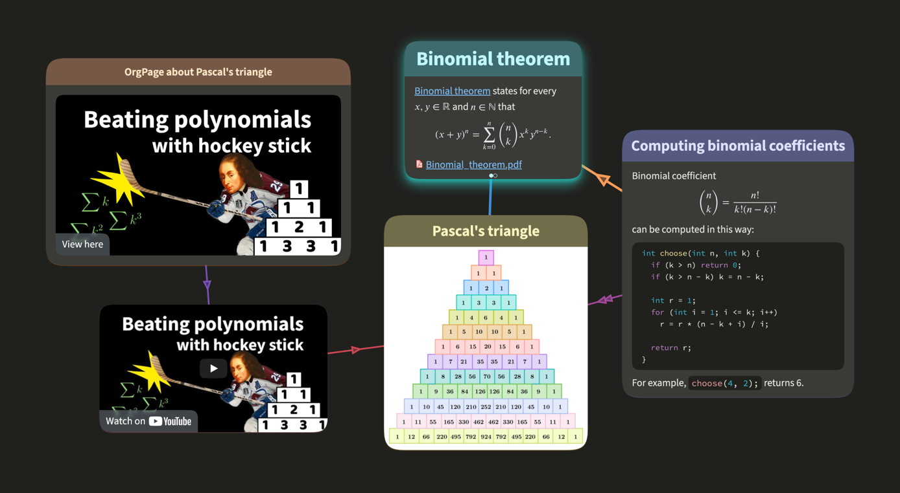
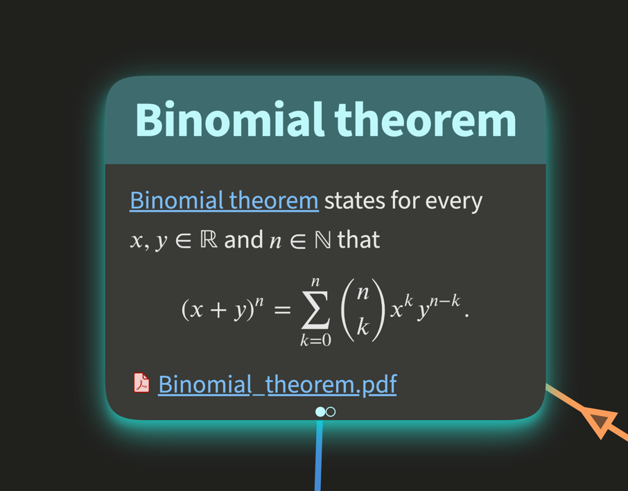
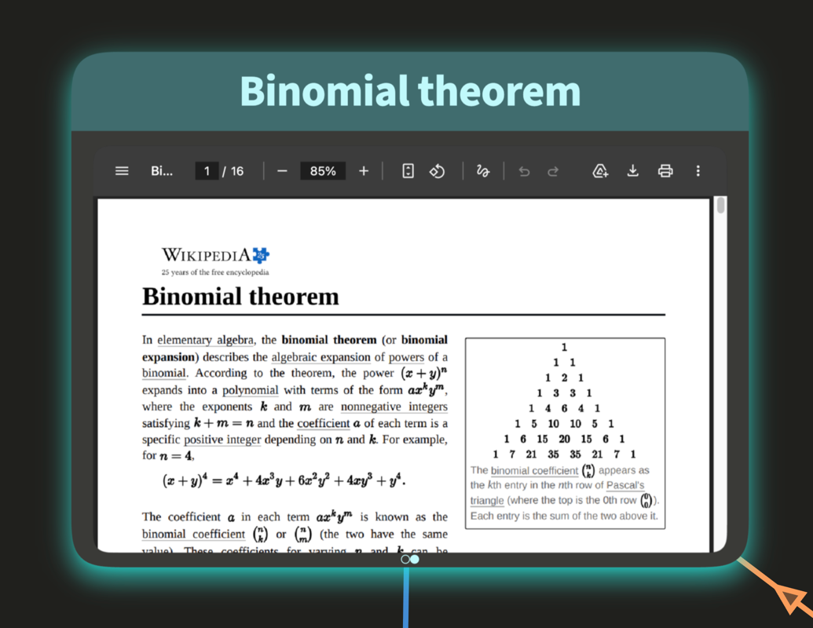
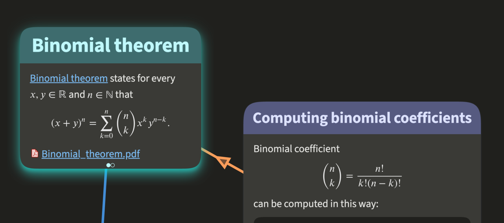
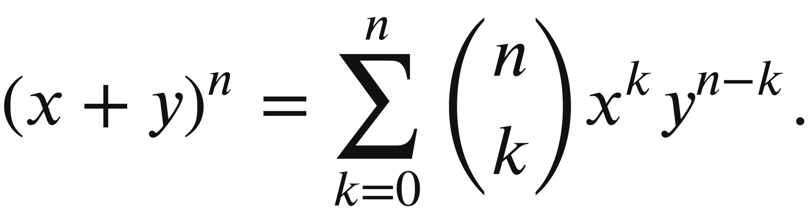
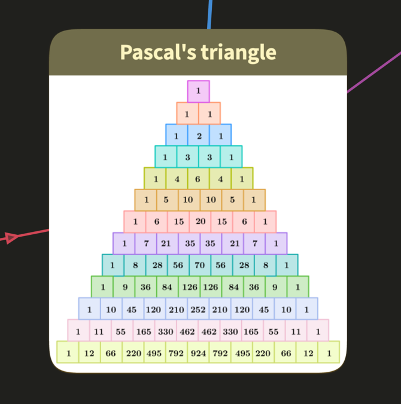

# OrgPage Data

Each OrgPage consists of units forming cells and links connecting them. The other objects include uploaded files and
images, math objects, and embed objects. This document explains how these objects look and how they connect to each
other.

## Contents

- [How OrgPage Objects Connect](#how-orgpage-objects-connect)
- [OrgPage Metadata](#orgpage-metadata)
- [Units](#units)
- [Links](#links)
- [Maths](#maths)
- [Embeds](#embeds)
- [Files](#files)
- [Images](#images)
- [Fragments](#fragments)
- [Paths and Path Steps](#paths-and-path-steps)
- [Colors](#colors)
- [Related Pages](#related-pages)

The data for the
[example OrgPage](https://orgpad.info/s/orgpage-data-example) is available as
[JSON](example-orgpage.json) and [EDN](example-orgpage.edn), exactly as it is returned by
`GET https://orgpad.info/api/v1/s/orgpage-data-example`.



## How OrgPage Objects Connect

OrgPage data is a graph of object collections. Objects are connected by IDs stored either in another object field
or inside page content.

| Collection                                       | How it connects                                                                                    |
|--------------------------------------------------|----------------------------------------------------------------------------------------------------|
| [`units`](#units)                                | Books form visible cells. Pages hold content and belong to books.                                  |
| [`links`](#links)                                | Links connect two book units with ordered `endpointIds` as `[from, to]`.                           |
| [`maths`](#maths)                                | Math objects are referenced from page content by math ID, one object per use.                      |
| [`embeds`](#embeds)                              | Embed objects use an embed ID in page content and either `fileId` or `source`, one object per use. |
| [`files`](#files)                                | Files are reusable attachments for hyperlinks, embeds, media tags, and `audioId`.                  |
| [`images`](#images)                              | Images are reusable attachments referenced from page content by image URLs.                        |
| [`fragments`](#fragments)                        | Fragments store named or implicit OrgPage view states.                                             |
| [`paths` and `pathSteps`](#paths-and-path-steps) | Paths use ordered path step view states for presentations.                                         |

ID reference rules:

- Book IDs identify canvas cells and are used by links.
- Page IDs identify content-bearing child pages inside books.
- [Text IDs](formats.md#text-ids) are stable custom unique identifiers for units, embeds and fragments. They can be used
  in API requests instead of IDs.
- Attachment tokens are separate from object IDs and are used for attachment access and reuse.

## OrgPage Metadata

The top-level map contains OrgPage metadata and vectors of objects that are omitted here and described separately
below.

```json
{
  "id": "e8efc539-e16f-4c28-9923-65022103bee1",
  "title": "OrgPage data example",
  "description": "A simple OrgPad created to showcase what OrgPad data looks like.",
  "tags": [
    "example",
    "API",
    "OrgPad",
    "data"
  ],
  "color": "color/purple",
  "initFragments": {
    "default": "361e0937-4876-4600-8815-39cae4bdbc96",
    "smallScreen": "1a23f4b4-d1ca-49e3-9741-d4811f899f8d"
  },
  "owner": "50475d55-4f6d-401f-9b08-33927a04897f",
  "creationTime": "2026-05-13T10:17:41.205102943Z",
  "lastLoadTime": "2026-05-14T00:22:40.201665Z",
  "lastEditTime": "2026-05-13T12:55:10.971368Z",
  "units": […],
  "links": […],
  "maths": […],
  "embeds": […],
  "files": […],
  "images": […],
  "fragments": […],
  "paths": […],
  "pathSteps": […]
}
```

In EDN, the same top-level data uses namespaced keys and keyword values:

```clojure
{:orgpage/id             #uuid "e8efc539-e16f-4c28-9923-65022103bee1"
 :orgpage/title          "OrgPage data example"
 :orgpage/description    "A simple OrgPad created to showcase what OrgPad data looks like."
 :orgpage/tags           #{"example" "API" "OrgPad" "data"}
 :orgpage/color          :color/purple
 :orgpage/init-fragments #:init-fragments{:default      #uuid"361e0937-4876-4600-8815-39cae4bdbc96"
                                          :small-screen #uuid"1a23f4b4-d1ca-49e3-9741-d4811f899f8d"}
 :orgpage/owner          #uuid "50475d55-4f6d-401f-9b08-33927a04897f"
 :orgpage/creation-time  "2026-05-13T10:17:41.205102943Z"
 :orgpage/last-load-time "2026-05-14T00:22:40.201665Z"
 :orgpage/last-edit-time "2026-05-13T12:55:10.971368Z"
 :orgpage/units          […]
 :orgpage/links          […]
 :orgpage/maths          […]
 :orgpage/embeds         […]
 :orgpage/files          […]
 :orgpage/images         […]
 :orgpage/fragments      […]
 :orgpage/paths          […]
 :orgpage/path-steps     […]}
```

Metadata fields:

- `id`: OrgPage ID.
- `title`: OrgPage title.
- `description`: OrgPage description.
- `tags`: OrgPage tags.
- `color`: OrgPage color.
- `initFragments`: fragments automatically displayed when OrgPage loads. `default` loads on desktop and tablet
  devices, `smallScreen` on mobile devices.
- `owner`: ID of the OrgPage owner.
- `creationTime`: time when the OrgPage was created, as a UTC ISO datetime string.
- `lastLoadTime`: time when the OrgPage was last opened, as a UTC ISO datetime string.
- `lastEditTime`: time of the last edit, as a UTC ISO datetime string. This field is omitted when the OrgPage has not
  been edited after creation.


## Units

Units form the visible cells in an OrgPage. There are two unit types: `unit/book` and `unit/page`. Each cell consists of
one book unit with a canvas position and optional title. The book contains one or more page units, and each page can
contain HTML content.

For JSON responses, unit `content` is returned as an HTML string. For EDN and Transit responses, content is returned as
[Hiccup data](https://github.com/weavejester/hiccup).

The following examples show the data for the Binomial Theorem cell.

### Book unit

In JSON format:

```json
{
  "title": "Binomial theorem",
  "id": "490b560f-a9ee-43b8-b6a2-cfaa6b88d0bd",
  "type": "unit/book",
  "textId": "binomial-book",
  "pos": [
    -678.4950106793899,
    -290.60864427844024
  ],
  "childUnitIds": [
    "da5b1957-7d24-44f9-869e-9cebe27f7e67",
    "06fcdc12-0d52-4847-9b88-c685d72f364e"
  ],
  "props": {
    "titleSize": "props/h2",
    "color": "color/teal"
  }
}
```

In EDN format:

```clojure
{:unit/title          "Binomial theorem"
 :unit/id             #uuid "490b560f-a9ee-43b8-b6a2-cfaa6b88d0bd"
 :unit/type           :unit/book
 :unit/text-id        "binomial-book"
 :unit/pos            [-678.4950106793899 -290.60864427844024]
 :unit/child-unit-ids [#uuid "da5b1957-7d24-44f9-869e-9cebe27f7e67"
                       #uuid "06fcdc12-0d52-4847-9b88-c685d72f364e"]
 :unit/props          {:props/title-size :props/h2
                       :props/color      :color/teal}}
```

### First page



In JSON format:

```json
{
  "parentId": "490b560f-a9ee-43b8-b6a2-cfaa6b88d0bd",
  "id": "da5b1957-7d24-44f9-869e-9cebe27f7e67",
  "type": "unit/page",
  "textId": "binomial-page1",
  "content": "…"
}
```

with this HTML content:

```html
<p>
  <a href="https://en.wikipedia.org/wiki/Binomial_theorem">Binomial theorem</a>
  states for every
  <math id="bf9dfb8f-e3c6-4d5b-93e6-2006dec8e294"></math>
  and
  <math id="bd17c7be-c295-436a-9ac7-525581a641d1"></math>
  that
</p>
<p>
  <math id="488d2221-c45e-4a4a-9845-ed2ff00f5ed3"></math>
</p>
<p>
  <a href="/file/A1wzY1upVBw5SBwTeHWt8k">
    
    Binomial_theorem.pdf
  </a>
</p>
```

This page content refers to three [math objects](#maths) by ID and links one [file object](#files) by ID.

In EDN format:

```clojure
{:unit/parent-id #uuid "490b560f-a9ee-43b8-b6a2-cfaa6b88d0bd"
 :unit/id        #uuid "da5b1957-7d24-44f9-869e-9cebe27f7e67"
 :unit/type      :unit/page
 :unit/text-id   "binomial-page1"
 :unit/content   [[:p
                   [:a {:href "https://en.wikipedia.org/wiki/Binomial_theorem"}
                    "Binomial theorem"]
                   " states for every "
                   [:math {:math/id #uuid "bf9dfb8f-e3c6-4d5b-93e6-2006dec8e294"}]
                   " and "
                   [:math {:math/id #uuid "bd17c7be-c295-436a-9ac7-525581a641d1"}]
                   " that"]
                  [:p
                   [:math {:math/id #uuid "488d2221-c45e-4a4a-9845-ed2ff00f5ed3"}]]
                  [:p
                   [:a {:href "/file/A1wzY1upVBw5SBwTeHWt8k"}
                    [:img {:width  24
                           :height 24
                           :src    "/static/img/files/pdf.svg"
                           :style  {:vertical-align "text-bottom"
                                    :margin-right   4
                                    :margin-bottom  6}}]
                    "Binomial_theorem.pdf"]]]}
```

### Second page



In JSON format:

```json
{
  "parentId": "490b560f-a9ee-43b8-b6a2-cfaa6b88d0bd",
  "id": "06fcdc12-0d52-4847-9b88-c685d72f364e",
  "type": "unit/page",
  "textId": "binomial-page2",
  "content": "<p><embed height=\"450\" id=\"6b921cb9-a9d9-4e43-b4a5-468ed99174b4\" width=\"700\" /></p>"
}
```

This page content refers to one [embed object](#embeds) by ID.

In EDN format:

```clojure
{:unit/parent-id #uuid "490b560f-a9ee-43b8-b6a2-cfaa6b88d0bd"
 :unit/id        #uuid "06fcdc12-0d52-4847-9b88-c685d72f364e"
 :unit/type      :unit/page
 :unit/text-id   "binomial-page2"
 :unit/content   [[:p
                   [:embed
                    {:embed/width  700
                     :embed/height 450
                     :embed/id     #uuid "6b921cb9-a9d9-4e43-b4a5-468ed99174b4"}]]]}
```

### Unit fields

Common fields:

- `id`: unit ID.
- `textId`: optional unique string identifier that can be used to [refer to the unit](formats.md#text-ids).
- `type`: `unit/book` or `unit/page`.

Book fields:

- `title`: book title, when present.
- `pos`: book position on the canvas as `[x, y]`; coordinates are floats between -1,000,000 and 1,000,000. The `x`
  coordinate grows to the right and the `y` coordinate grows downward.
- `childUnitIds`: page IDs contained in a book.
- `props`: visual properties of the cell.
    - `titleSize` is `props/h1`, `props/h2`, or `props/h3`.
    - `color` is one of the supported [OrgPad colors](#colors).

Page fields:

- `parentId`: ID of the parent book of a page.
- `content`: page content. In JSON responses, content is returned as HTML. In EDN and Transit responses, content is
  returned as [Hiccup data](ops_content.md#hiccup).

## Links

Links connect two book units. The `endpointIds` array is ordered as `[from, to]`, which matters for directional links
with an arrowhead.



In JSON format:

```json
{
  "id": "0af5d31c-57f3-4a6f-b801-221f2c28ee15",
  "endpointIds": [
    "f71d5f0e-7863-4ab6-8f24-1e1dea820bb5",
    "490b560f-a9ee-43b8-b6a2-cfaa6b88d0bd"
  ],
  "props": {
    "weight": "props/strong",
    "arrowhead": "props/single",
    "color": "color/orange"
  }
}
```

In EDN format:

```clojure
{:link/id           #uuid "0af5d31c-57f3-4a6f-b801-221f2c28ee15"
 :link/endpoint-ids [#uuid "f71d5f0e-7863-4ab6-8f24-1e1dea820bb5"
                     #uuid "490b560f-a9ee-43b8-b6a2-cfaa6b88d0bd"]
 :link/props        {:props/weight    :props/strong
                     :props/arrowhead :props/single
                     :props/color     :color/orange}}
```

Links in OrgPad have no built-in label field and no dedicated “link label” object. To label a connection, insert a cell
between the two connected cells and connect it to each one with a separate link. Style the intermediate cell as a label
— typically using a smaller title size and a distinct color. This design keeps the data model simple while providing
more flexibility: the label is a regular cell, so it supports rich content, all cell styling options, and connections to
multiple cells.

### Link fields

- `id`: link ID.
- `endpointIds`: exactly two book unit IDs connected by the link, ordered as `[from, to]`.
- `props`: visual properties of the link.
    - `weight`: line weight. When present, `props/strong` makes the link stronger.
    - `arrowhead`: arrowhead style. Supported values are `props/none`, `props/single`, and `props/double`.
    - `color`: one of the supported [OrgPad colors](#colors).

## Maths

Math objects store rendered math referenced from page content by `<math id="…"></math>` in JSON HTML content
and `[:math {:math/id #uuid "…"}]` in EDN Hiccup content. Each math object is used exactly once in exactly one page. If
the same formula appears multiple times in an OrgPage, each occurrence has its own math object and its own math ID. This
differs from files and images, which can be reused from multiple places and even multiple OrgPages.



In JSON format:

```json
{
  "id": "488d2221-c45e-4a4a-9845-ed2ff00f5ed3",
  "pageId": "da5b1957-7d24-44f9-869e-9cebe27f7e67",
  "type": "math/math",
  "block": true,
  "source": "(x+y)^n = \\sum_{k=0}^n {n \\choose k} x^ky^{n-k}.",
  "width": 25.875,
  "height": 7.176,
  "verticalAlign": -3.171,
  "svg": "<svg>…</svg>"
}
```

In EDN format:

```clojure
{:math/id             #uuid "488d2221-c45e-4a4a-9845-ed2ff00f5ed3"
 :math/page-id        #uuid "da5b1957-7d24-44f9-869e-9cebe27f7e67"
 :math/type           :math/math
 :math/block          true
 :math/source         "(x+y)^n = \\sum_{k=0}^n {n \\choose k} x^ky^{n-k}."
 :math/width          25.875
 :math/height         7.176
 :math/vertical-align -3.171
 :math/svg            "<svg>…</svg>"}
```

### Math fields

- `id`: math object ID.
- `pageId`: ID of the page unit where the math object is used.
- `block`: when `true`, the formula is rendered as a block formula. When omitted or `false`, it is inline.
- `type`: math renderer type. Usually `math/math`; chemistry formulas use `math/chemistry`, which renders the source
  through `\ce{…}`.
- `source`: formula source in LaTeX syntax.
- `width` and `height`: rendered formula dimensions in `ex` units.
- `verticalAlign`: baseline alignment offset, also in `ex` units.
- `svg`: rendered SVG produced by [MathJax](https://www.mathjax.org/). This field can be large. Clients that only need
  the source formula can ignore it.

## Embeds

Embeds allow inserting external websites or [uploaded files](#files) into unit content. They are referenced from unit
content by `<embed id="…"></embed>` in JSON HTML content and `[:embed {:embed/id #uuid "…"}]` in EDN Hiccup content.
Like math objects, each embed object is used exactly once in exactly one page. A repeated embed has a separate embed ID.

### External websites

In JSON format:

```json
{
  "id": "6a6d38fd-8133-4666-b1c2-1881c6c5bb54",
  "pageId": "06fcdc12-0d52-4847-9b88-c685d72f364e",
  "source": "https://example.com"
}
```

In EDN format:

```clojure
{:embed/id      #uuid "6a6d38fd-8133-4666-b1c2-1881c6c5bb54"
 :embed/page-id #uuid "06fcdc12-0d52-4847-9b88-c685d72f364e"
 :embed/source  "https://example.com"}
```

Embedded OrgPages and YouTube videos are represented differently. [Embedded OrgPages](content.md#embedded-orgpage) use a
custom `<orgpage>` tag in unit content, and [YouTube videos](content.md#youtube-video) use a custom `<youtube>` tag.
They do not appear in the `embeds` collection.

### Uploaded files

In JSON format:

```json
{
  "id": "6b921cb9-a9d9-4e43-b4a5-468ed99174b4",
  "pageId": "06fcdc12-0d52-4847-9b88-c685d72f364e",
  "fileId": "35c33635-ba95-41c3-9481-c137875adf24"
}
```

In EDN format:

```clojure
{:embed/id      #uuid "6b921cb9-a9d9-4e43-b4a5-468ed99174b4"
 :embed/page-id #uuid "06fcdc12-0d52-4847-9b88-c685d72f364e"
 :embed/file-id #uuid "35c33635-ba95-41c3-9481-c137875adf24"}
```

### Embed fields

- `id`: embed object ID.
- `pageId`: ID of the page unit where the embed is used.
- `fileId`: uploaded [file](#files) ID for a file embed.
- `source`: external URL for a URL embed.
- `textId`: [text ID](formats.md#text-ids) of the embed which can be used instead of its ID. It also
  allows [sending messages between embeds](https://orgpad.info/s/embed-messaging).

An embed has either `fileId` or `source`, never both.

## Files

Files are uploaded attachments that are not handled as images. A file can be used by multiple OrgPages; the same file
ID may appear in each OrgPage that references it.

OrgPage data can use files in four ways:

- As a [file hyperlink with an icon](content.md#attached-file).
- As a file embed through an [embed object](#embeds).
- As the source of a [video](content.md#video) or [audio](content.md#audio) tag, when the file content type is playable as that media type.
- As presentation step audio through a [path step](#paths-and-path-steps) `audioId`.

In JSON format:

```json
{
  "id": "35c33635-ba95-41c3-9481-c137875adf24",
  "token": "2498ced3-60be-48b7-b86a-9b5b3a79316e",
  "filename": "Binomial_theorem.pdf",
  "contentType": "application/pdf",
  "size": 947386,
  "lastModified": "2026-05-13T12:52:48.415900369Z"
}
```

In EDN format:

```clojure
{:file/id            #uuid "35c33635-ba95-41c3-9481-c137875adf24"
 :file/token         #uuid "2498ced3-60be-48b7-b86a-9b5b3a79316e"
 :file/filename      "Binomial_theorem.pdf"
 :file/content-type  "application/pdf"
 :file/size          947386
 :file/last-modified "2026-05-13T12:52:48.415900369Z"}
```

The [first page](#first-page) in the example OrgPage links to this PDF file. In JSON content, OrgPad returns the file
link as a normal HTML link containing a file-type icon:

```html
<p>
  <a href="/file/A1wzY1upVBw5SBwTeHWt8k">
    
    Binomial_theorem.pdf
  </a>
</p>
```

In EDN content, the same link is represented as Hiccup:

```clojure
[[:p
  [:a {:href "/file/A1wzY1upVBw5SBwTeHWt8k"}
   [:img {:width  24
          :height 24
          :src    "/static/img/files/pdf.svg"
          :style  {:vertical-align "text-bottom"
                   :margin-right   4
                   :margin-bottom  6}}]
   "Binomial_theorem.pdf"]]]
```

The [second page](#second-page) embeds the same PDF through the [embed object](#embeds)
`6b921cb9-a9d9-4e43-b4a5-468ed99174b4`, whose `fileId` points to this file. Only PDF files and Word, Excel, and
PowerPoint documents can be embedded this way.

Video and audio content use files in the same attachment collection, but reference them from `<source>` nested
inside `<video>` or `<audio>` tags instead of through a file hyperlink. Playable video files use `video/mp4`
or `video/webm`. Playable audio files use `audio/mpeg`, `audio/wav`, `audio/ogg`, `audio/flac`, `audio/mp4`,
`audio/x-m4a`, or `audio/aac`.

### File fields

- `id`: file ID.
- `token`: file access token. It is used in OrgPad-generated links and can be supplied when reusing a file in another
  OrgPage where the file is not already present.
- `filename`: displayed file name.
- `contentType`: MIME content type, such as `application/pdf`.
- `size`: file size in bytes.
- `lastModified`: last modification timestamp, as a UTC ISO datetime string.

## Images

Images are uploaded image attachments. An image can be used by multiple OrgPages; the same image ID may appear in each
OrgPage that references it.

OrgPad stores these formats as images: PNG, JPEG/JPG, GIF, SVG, TIFF, and WebP. Other image formats can still be
uploaded, but they are stored as generic [files](#files), not image attachments.

Unit content references images through `` in JSON HTML content or an `[:img {:src "…"}]` Hiccup node
in EDN content.



In JSON format:

```json
{
  "id": "c40700c0-7b5b-4cf6-8983-31b4483f531b",
  "token": "8b52d311-9b92-4d27-9777-477787b9efe2",
  "filename": "pascal.png",
  "format": "png",
  "thumbnailFormat": "png",
  "width": 540,
  "height": 540,
  "size": 10792,
  "url": "https://dr282zn36sxxg.cloudfront.net/…",
  "thumbnailSizes": [
    {
      "width": 540,
      "height": 540,
      "size": 10792
    },
    {
      "width": 500,
      "height": 500,
      "size": 46379
    },
    {
      "width": 250,
      "height": 250,
      "size": 18619
    },
    {
      "width": 125,
      "height": 125,
      "size": 7498
    }
  ],
  "lastModified": "2026-05-13T10:21:36.156948376Z"
}
```

In EDN format:

```clojure
{:image/id               #uuid "c40700c0-7b5b-4cf6-8983-31b4483f531b"
 :image/token            #uuid "8b52d311-9b92-4d27-9777-477787b9efe2"
 :image/filename         "pascal.png"
 :image/width            540
 :image/height           540
 :image/format           "png"
 :image/thumbnail-format "png"
 :image/size             10792
 :image/last-modified    "2026-05-13T10:21:36.156948376Z"
 :image/url              "https://dr282zn36sxxg.cloudfront.net/…"
 :image/thumbnail-sizes  [{:thumbnail/width  540
                           :thumbnail/height 540
                           :thumbnail/size   10792}
                          {:thumbnail/width  500
                           :thumbnail/height 500
                           :thumbnail/size   46379}
                          {:thumbnail/width  250
                           :thumbnail/height 250
                           :thumbnail/size   18619}
                          {:thumbnail/width  125
                           :thumbnail/height 125
                           :thumbnail/size   7498}]}
```

The example OrgPage contains an image-only page. In JSON content:

```html
<p>
  
</p>
```

In EDN content:

```clojure
[[:p
  [:img {:src    "/img/DEBwDAe1tM9omDMbRIP1Mb"
         :width  500
         :height 500}]]]
```

If a unit consists of a single image and the book has no title, OrgPad renders the image directly on the background
canvas without the usual cell borders. This is useful for transparent images and diagram elements that should look like
part of the canvas.

OrgPad automatically generates smaller versions of each uploaded image. When rendering an OrgPage, OrgPad chooses the
best available image version for the current zoom level, so the canvas can stay sharp without downloading the full
image when a smaller thumbnail is enough.

### Image fields

- `id`: image ID.
- `token`: image access token. It can be used when reusing an image in another OrgPage where the image is not already
  present.
- `filename`: original or current image file name.
- `width` and `height`: full image dimensions in pixels.
- `format`: image format, such as `png` or `jpg`.
- `thumbnailFormat`: format used for generated thumbnails.
- `size`: size in bytes of the main image without thumbnails.
- `url`: URL from which the image was downloaded. It will be missing when uploaded using API.
- `thumbnailSizes`: available generated thumbnail variants with their width, height, and size in bytes.
- `lastModified`: last modification timestamp, as a UTC ISO datetime string.

## Fragments

Fragments store named OrgPage locations. A location describes how the OrgPage view changes when activated: which pages
are opened, which books are closed, which books the camera focuses on, and which books are shown or hidden. In the
OrgPad app, fragments are called locations. For a user-facing introduction, see
[Create and Share Locations Inside Your Document](https://orgpad.info/blog/locations).

Fragments are partial view changes. If a fragment does not mention a book or page, activating the fragment does not
change that object. For example, a previously opened book stays opened unless the fragment explicitly closes it, and a
previously hidden book stays hidden unless the fragment explicitly reveals it. This makes it possible to combine
multiple fragments together, for example when building an interactive quiz such as
[Human Body Quiz](https://orgpad.info/s/human-body-quiz).

OrgPad also supports implicit fragments. These are not stored in the `fragments` collection, but the same fragment
lookup accepts their IDs:

- A unit ID or unit `textId` focuses that unit. If the unit is a page, that page is also opened.
- A link ID focuses the link endpoints.
- A path step ID applies the same view state as that presentation step, without starting presentation mode.
- A path ID applies the first step of that path.

In JSON format:

```json
{
  "id": "1a23f4b4-d1ca-49e3-9741-d4811f899f8d",
  "textId": "pascal-video",
  "title": "Pascal video",
  "openedPageIds": [
    "ce6be8c1-8de4-462c-8b51-094412bf42ea"
  ],
  "focusedBookIds": [
    "b47226d3-226b-4c79-91a3-095a2bddbdd3",
    "d9c8360b-0811-4808-97ed-f1f65f208fed"
  ]
}
```

In EDN format:

```clojure
{:fragment/id               #uuid "1a23f4b4-d1ca-49e3-9741-d4811f899f8d"
 :fragment/text-id          "pascal-video"
 :fragment/title            "Pascal video"
 :fragment/opened-page-ids  #{#uuid "ce6be8c1-8de4-462c-8b51-094412bf42ea"}
 :fragment/focused-book-ids #{#uuid "b47226d3-226b-4c79-91a3-095a2bddbdd3"
                              #uuid "d9c8360b-0811-4808-97ed-f1f65f208fed"}}
```

### Fragment fields

- `id`: fragment ID.
- `textId`: optional unique text identifier. In OrgPad links, this is the location identifier after `#`.
- `title`: displayed location name.
- `openedPageIds`: page units opened when the fragment is activated.
- `closedBookIds`: book units closed when the fragment is activated.
- `focusedBookIds`: book units used for the camera focus.
- `shownBookIds`: book units explicitly revealed when the fragment is activated. Revealed books have full opacity.
- `hiddenBookIds`: book units hidden when the fragment is activated. Hidden books are invisible and have zero opacity.

## Paths and Path Steps

Paths are ordered presentations. A path stores the presentation title and ordered step IDs. Each path step stores a
view state for one moment in the presentation.

Path steps use the same view-state fields as [fragments](#fragments): opened pages, closed books, focused books, shown
books, and hidden books. Unlike fragments, path steps are used in a fixed order by a presentation.

Path in JSON format:

```json
{
  "id": "6d12c87d-1804-472b-8cc7-b2259ef2ba27",
  "title": "Example presentation",
  "stepIds": [
    "5911ae1b-1b23-4c95-845c-813e12d131e1",
    "04f7bb75-7b6f-4b3c-a55c-ec553c7d5361",
    "aa15e4c0-d1a0-4697-a38a-6eb013a26b74",
    "cc472b3b-7df7-40ee-b9cb-6668c49f31df",
    "488cee41-0f98-423e-8b92-ef5df91e2903",
    "4bf18c56-55e5-46dd-b308-0a9cb44c72f6"
  ]
}
```

Path in EDN format:

```clojure
{:path/id       #uuid "6d12c87d-1804-472b-8cc7-b2259ef2ba27"
 :path/title    "Example presentation"
 :path/step-ids [#uuid "5911ae1b-1b23-4c95-845c-813e12d131e1"
                 #uuid "04f7bb75-7b6f-4b3c-a55c-ec553c7d5361"
                 #uuid "aa15e4c0-d1a0-4697-a38a-6eb013a26b74"
                 #uuid "cc472b3b-7df7-40ee-b9cb-6668c49f31df"
                 #uuid "488cee41-0f98-423e-8b92-ef5df91e2903"
                 #uuid "4bf18c56-55e5-46dd-b308-0a9cb44c72f6"]}
```

Path step in JSON format:

```json
{
  "id": "04f7bb75-7b6f-4b3c-a55c-ec553c7d5361",
  "openedPageIds": [
    "da5b1957-7d24-44f9-869e-9cebe27f7e67"
  ],
  "focusedBookIds": [
    "490b560f-a9ee-43b8-b6a2-cfaa6b88d0bd"
  ]
}
```

Path step in EDN format:

```clojure
{:step/id               #uuid "04f7bb75-7b6f-4b3c-a55c-ec553c7d5361"
 :step/opened-page-ids  #{#uuid "da5b1957-7d24-44f9-869e-9cebe27f7e67"}
 :step/focused-book-ids #{#uuid "490b560f-a9ee-43b8-b6a2-cfaa6b88d0bd"}}
```

### Path fields

- `id`: path ID.
- `title`: displayed presentation title.
- `stepIds`: ordered path step IDs. This order is the presentation order.

### Path step fields

- `id`: path step ID.
- `openedPageIds`: page units opened in this step.
- `closedBookIds`: book units closed in this step.
- `focusedBookIds`: book units used for the camera focus in this step.
- `shownBookIds`: book units revealed in this step. Revealed books have full opacity.
- `hiddenBookIds`: book units hidden in this step. Hidden books are invisible and have zero opacity.
- `audioId`: optional [file](#files) ID of the audio played for this presentation step.

## Colors

Several OrgPage fields use OrgPad colors: OrgPage colors, unit colors, link colors, and text highlight colors.
JSON represents colors as strings:

```json
"color/orchid"
```

EDN represents colors as keywords:

```clojure
:color/orchid
```

All colors:

- `color/white`
- `color/light-gray`
- `color/gray`
- `color/red`
- `color/orange`
- `color/yellow`
- `color/lime`
- `color/green`
- `color/mint`
- `color/teal`
- `color/blue`
- `color/blueberry`
- `color/purple`
- `color/orchid`
- `color/pink`

See the visual [list of OrgPad colors](https://orgpad.info/s/colors).

Units and links support all 15 colors.

OrgPages and text highlights support only the 12 spectrum colors: all colors except `color/white`, `color/light-gray`,
and `color/gray`.

## Related Pages

Use these pages when OrgPage data connects to reading, editing, content, or attachments.

| Page                                   | When to use it                                     |
|----------------------------------------|----------------------------------------------------|
| [Read endpoints](read.md)              | See how OrgPage data is returned by API endpoints. |
| [Operations](ops.md)                   | Create and update OrgPage data.                    |
| [Unit content](content.md)             | Understand supported content inside page units.    |
| [Attachments](attachments.md)          | Upload, download, and rename files and images.     |
| [Input and output formats](formats.md) | Choose JSON, EDN, or Transit response formats.     |
| [API cookbook](cookbook.md)            | See practical examples using OrgPage data.         |
